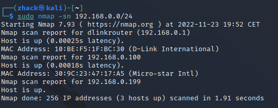
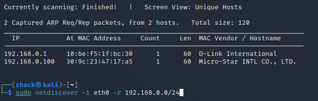
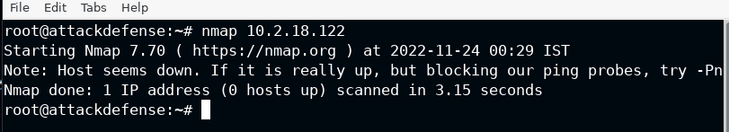
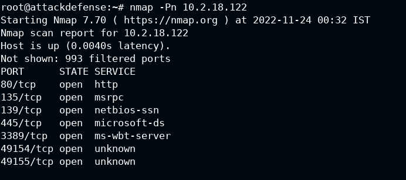
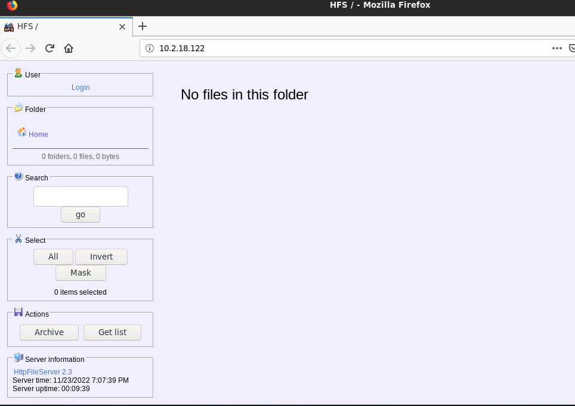
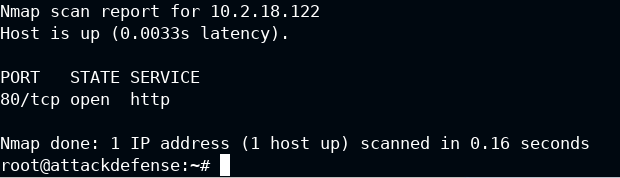
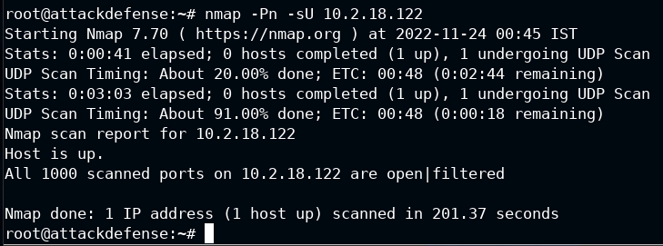
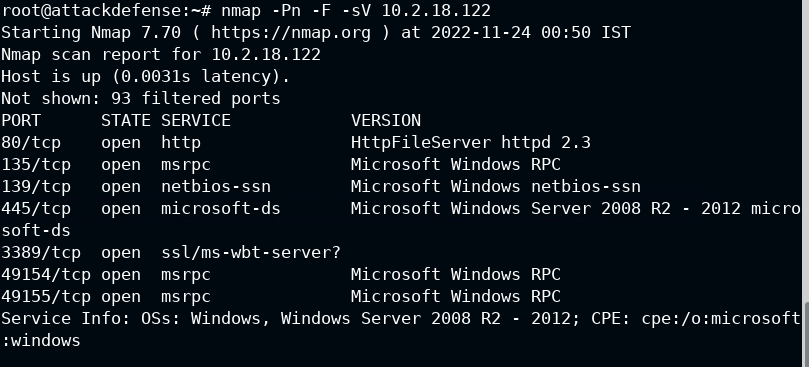
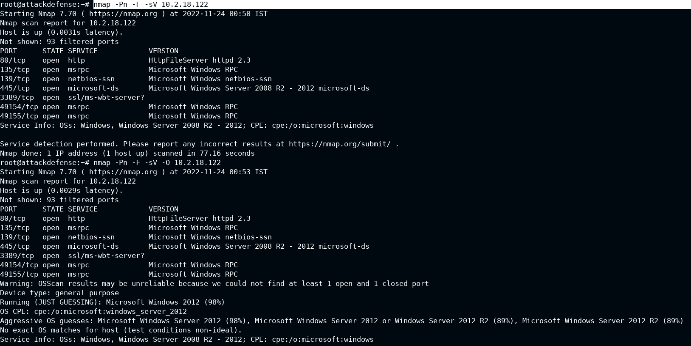
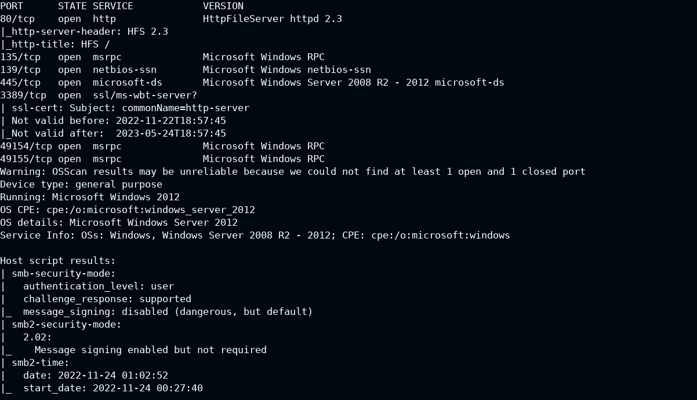

# Indice

- [Information Gathering](#Information-Gathering)
    - [Passive](#Passive)
        * [Website Recon & Footprinting](#Website-Recon-And-Footprinting)
        * [Whois Enumeration](#Whois-Enumeration)
        * [Netcraft](#Netcraft)
        * [DNS Recon](#DNS-Recon)
        * [WAF (web aplication firewall) Detection With wafw00f](#WAF-Detection-With-wafw00f)
        * [Subdomain Enumeration With Sublist3r](#Subdomain-Enumeration-With-Sublist3r)
        * [Google Dorks](#Google-Dorks)
        * [Email Harvesting With theHarvester](#Email-Harvesting-With-theHarvester)
        * [Leaked passwords databases](#Leaked-passwords-databases)
    - [Active](#Active)
        * [DNS Zone Transfers](#DNS-Zone-Transfers)
        * [Host Discovery With Nmap](#Host-Discovery-With-Nmap)
        * [Port Scanning With Nmap](#Port-Scanning-With-Nmap)

# Information Gathering
- Alexis ahmed -- aahmed@ine.com twitter --> HackerSploit
----------------------------------------------------------

- Passive information gathering - Obtencion de la informacion publica accesible desde la red (google, redes...)
- Active information gathering - Informacion que obtenemos accediendo a los sistemas del objetivo

## Prerequisites

- Basic linux --> usaremos Kali Linux para este curso
- Basci web technologies

## Introduction

Information Gathering es la primera fase de un test de penetracion, aqui recopilamos informacion de los sitemas a los cuales vamos a hacer el pentesting.
Este conocimiento nos ayudará en las siguientes fases y cuanto mas sepamos de nuestro objetivo mas facil nos será acceder.

Esta fase se divide en dos:
- Passive information gathering --> En esta fase usamos la informacion accesible de forma "publica" para obtener informacion de nuestro objetivo.
- Active information gathering --> En esta fase es cuando utilizaremos tecnicas activas para obtener informacion de nuestro objetivo, por ejemplo si obtubimos la IP en la fase pasiva aqui podriamos usar un nmap para ver los puertos abiertos en esta IP. Para realizar esta fase necessitamos permisos de la compañia objetivo.

### Ejemplos de informacion que podemos obtener de una web en cada una de las fases:
- Passive:
    - ip adress & informacion DNS
    - nombre de dominio y propietario
    - cuentas de correo y perfiles de redes sociales
    - technologias usadas
    - informacion de subdominios
- Activa:
    - Puertos abiertos en los sistemas
    - Informacion de la estructura interna 
    - Enumerar informacion de los sistemas objetivos
--------------


# Passive:

## Website Recon And Footprinting

En esta seccion revisaremos el proceso de obtener informacion pasiva de un sitio web.

- Que buscaremos?
    - Ip
    - Directorios ocultos de los buscadores
    - Nombres
    - Cuentas de mail
    - Numeros de telefono
    - Direcciones fisicas
    - Technologias web usadas
    - ...

---------

### Obtener la ip:

- Comando linux: 
    - ```whatis host```
    - ```host 'url'```

-----

### Directorios ocultos:

Una manera de ver los dirrectorios ocultos de los buscadores podría ser intentando ver el fichero "robots.txt" que tienen algunas web.

Por ejemplo en https://hackersploit.org/robots.txt .

Otro fichero que podemos mirar es el "sitemap_index.xml" --> https://hackersploit.org/sitemap_index.xml .

----

### Tecnologias web usadas:

Hay diversas app que nos ayudarán en esta tares, por ejemplo hay un addon para firefox llamado BuildWith que nos puede decir que se esta usando en cualquier web.

Tambien podemos usar "whatweb" que es una aplicacion incluida en la consola de Kali:

```whatweb hackersploit.org```

Con la app HTTrack podemos descargar una copia del codigo de la web para poderlo analizar.

--------

### Whois Enumeration

whois es un protocolo de internet que usaremos para obtener informacion de los servidores de un sitio web.

Comando Kali:
```whois hackersploit.org```

Tambien existe la web https://who.is que hace la misma funcion que el whois.

-------

### Netcraft

Netcraft es una utilidad que nos ayuda a complementar la informacion que conseguimos con el whois.


Con esta utilidad tambien podemos obtener informacion de los certificados SSL y TLS.

Basicamente te hace un resumen de toda la informacion que puede obtener de una URL muy bien organizada.

-----

### DNS Recon

Es un script de Python que chekea todos los registros NS, dandonos los datos registrados en un DNS de un dominion especifico, algunos de estos registros son:

- Registros de DNS:
    - MX --> mail adress
    - SOA
    - NS
    - A --> registro ipv4
    - AAAA --> registro ipv6
    - SPF
    - TXT

Este script nos viene incluido en Kali, por lo que con este SO no necessitamos instalarlo.

Ejemplo:

```dnsrecon -d hackersploit.org```
```dnsrecon -d zonetransfer.me```

Otra buena opcion para obtener informacion DNS de un dominio es la web https://dnsdumpster.com

----

### WAF-Detection-With-wafw00f
WAF(web aplication firewall)

Es una aplicacion que nos ayudará a detectar si hay un aplicacion de firewall web en una pagina web.

```https://github.com/EnableSecurity/wafw00f```

Viene precompilado con Kali.

Ejemplo de uso:

```wafw00f hackersploit.org``` --> para en cuando detecta uno.

```wafw00f hackersploit.org -a``` --> para que siga buscando si encuentra uno, por si hay mas.

---

### Subdomain Enumeration With Sublist3r

Sublist3r es una herramienta opensource para enumerar subdominios. (es un script de Python)

```https://github.com/aboul3la/Sublist3r```

Esta herramienta usa los motores de busqueda para encontrar los dominios, tambien usa algunas herramientas para obtener mas informacion. Mas info en el github.

Esta herramienta no viene preinstalada (en el repositorio hay instrucciones para instalarla)

Tambien podemos especificar en que motores de busqueda queremos que haga la enumeracion.

Ejemplo de uso:

```sublist3r -d ine.com```
```sublist3r -d zonetransfer.me```
```sublist3r -d zonetransfer.me -e google,yahoo``` --> para buscar en google y yahoo
```sublist3r -d hackersploit.org```
```sublist3r -d hackersploit.org -e google,yahoo``` --> para buscar en google y yahoo


Puede ser que algunos sitios no devuelvan subdominio porque nos esten bloqueando.

----

### Google Dorks

Google hacking

Usaremos google y sus filtros para encontrar exactamente lo que buscamos. (Ficheros PDF de un dominio, informacion exacta, etc)

Ejemplos de uso:

```site:ine.com``` --> Devuelve todos los resultados para el dominio "ine.com".
```site:ine.com inurl:admin``` --> Devuelve todos los resultados anteriores que tengan "admin" en la URL.
```site:*.ine.com``` --> esto nos devuelve todos los subdominios de "ine.com"
```site:*.ine.com filetype:pdf``` --> esto nos devuelve los ficheros pdf que encuentre en los subdominios de "ine.com"

Otros ejemplos de busqueda:

```https://www.exploit-db.com/google-hacking-database```

- Waybackmachine.com --> para ver como eran antiguamente las paginas.

Aveces visitando versiones antiguas de una web podemos encontrar informacion sensible que han eliminado posteriormente.

----

### Email Harvesting With theHarvester 

theHarvester es una herramienta que usaremos para enumerar emails de un dominio en concreto.

Es una herramienta opensource y la podemos conseguir en el siguiente repositorio:

```https://github.com/laramies/theHarvester```

(Tambien viene pre-empaquetada con Kali)

Ejemplo de uso: 

```theHarvester -d hackersploit.org -b google, linkedin, yahoo, dnsdumpster, duckduckgo, crtsh```
en esta prueba no hemos encontrado emails pero en la siguiente si:
```theHarvester -d zonetransfer.me -b google, linkedin, yahoo, dnsdumpster, duckduckgo, crtsh```

----

### Leaked passwords databases

Existen databases que estan publicas online y las podemos detectar de la siguiente manera:

Web de interes:
```https://haveibeenpwned.com```

En esta web se guarda un registro de la informacion que ha sido vulnerada en algunos sitios web tipo Facebook, google, Twitter...

---
# Active

## DNS Zone Transfers

### Que es un DNS?

Es un protocolo para transformar los nombres de dominio o de host en direcciones IP.

```
- DNS records:
    - A : resuelve un nombre de dominio a ipv4
    - AAAA : resuelve un nombre de dominio a ipv6
    - NS : referencia al domain nameserver
    - MX : resuelve el dominio de un servidor mail
    - CNAME : domain alias
    - TXT : text record
    - HINFO : informacion del host
    - SOA : domain authority
    - SRV : service records
    - PTR : transforma una IP a un hostname
```
### DNS Interrogation

Es la enumeracion de los registrons de un DNS para obtener informacion valiosa como IP de dominio, subdominios, mail servers...

### DNS Zone Transfer

En algunas ocasiones los administradores quieren copiar ficheros de un DNS a otro, este proceso se llama DNS Zone Transfer.

Si esto no se hace de forma correcta un atacante puede aprovechar para interceptar esta informacion que le puede servir para saber sobre la estructura del dominio y obtener informacion valiosa.

Ejemplo de uso:

```dnsrecon -d zonetransfer.me```
```dnsenum zonetransfer.me```
zonetransfer.me es un servidos preparado para hacer esta prueba.

Una vez que hemos detectado los DNS del dominio con los comandos anteriores podemos sacar informacion de ellos con:

```dig axfr @nsztm1.digi.ninja zonetransfer.me```

Otra herramienta que podemos usar para sacar informacion de un dominio es:

```fierce --domain hackersploit.org```


*Como dato, los SO tienen un fichero donde guardan algunos hosts localmente en linux esta en /etc/hosts, estos registros los cogera sin consultar el servidor y podemos añadir los que queramos*

---

## Host Discovery With Nmap

Podemos usar el siguiente comando para buscar un host:

`nmap -sn 192.168.0.0/24` --> -sn es para que solo nos muestre los hosts sin escanear los puertos.
En la IP tenemos que poner la de red.



Otro comando que podemos usar es:

`netdiscover 192.168.0.0/24 -i eth0 -r 192.168.0.0/24` --> "-i" especificamos por que interficie queremos buscar, "-r" que rango de ip buscamos.



---
## Port Scanning With Nmap
### LAB

Si hacemos un nmap basico solo escaneará los puertos habitualmente usados.

`nmap "ip"`

Hay que tener cuidado cuando escaneamos sistemas windows porque suelen bloquear los ping, por lo que nos puede devolver un error como el siguiente:



Con el atributo "-Pn" le decimos que no haga pings, asi evitamos el error:



Por los servicios que vemos activos en los puertos podemos comprobar que este es un host windows, y que ademas tiene un servicio http abierto.

Para verificarlo podemos ir a un navegador y probar de navegar.

Podemos ver que esta accesible un file server:




`nmap -Pn -p- 10.2.18.122` --> Con este comando escanería todos los puertos, no lo ejecutaremos porque nos llevaría demasiado tiempo.

`nmap -Pn -p80 10.2.18.122` --> Tambien podemos especificar el puerto que queremos escanear.




`nmap -Pn -p 80,445,3389 10.2.18.122` --> Tambien podemos buscar varios puertos

`nmap -Pn -p 1-1000 10.2.18.122` --> Tambien podemos especificar un rango.

Nmap normalmente solo escanea los puertos TCP, para mirar los UDP debemos especificarlo:

`nmap -Pn -sU 10.2.18.122`



Este comando puede tardar bastante.

Tambien podemos saber la version del servicio con el siguiente comando:

`nmap -Pn -F -sV 10.2.18.122`

Esto nos puede ser util para buscar informacion de vulnerabilidades para el servicio y la version que esta corriendo en ese puerto.



Si añadimos el atributo "-O" nos dará tambien informacion mas detallada del sistema operativo.

`nmap -Pn -F -sV -O 10.2.18.122`

Podemos ver que nos dice que es un Windows Server 2012:



Si añadimos "-sC" se ejecutarán una serie de scrips de Nmap que nos ayudarán a obtener mas informacion de los puertos abiertos:

`nmap -Pn -F -sV -O -sC 10.2.18.122`

En la imagen podemos ver que nos devuelve lo mismo que el anterior comando pero da un poco mas de detalle:




Para acabar mas rapido podemos hacer un nmap agresivo, que es lo mismo que el ultimo pero solo es necessario poner el atributo "-A".

`nmap -Pn -F -A 10.2.18.122 `
