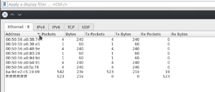
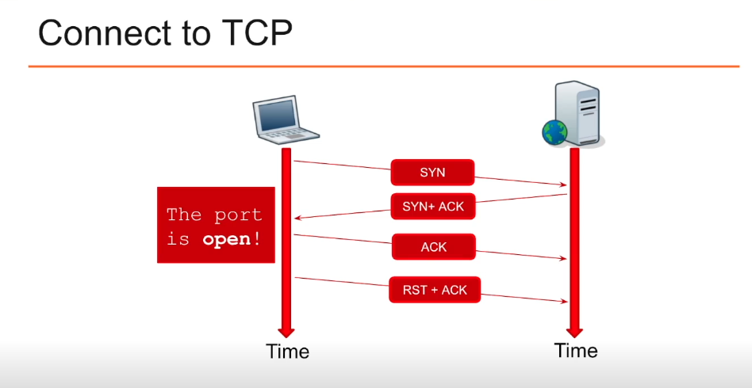

# Assessment Methodologies: Footprinting & Scanning 
## Index
- [Introduccion](#introduccion)
  - [Objetivos de aprendizage](#objetivos-de-aprendizage)
- [Mapping a Network](#mapping-a-network)
  - [Objetivos](#objetivos)
  - [Proceso](#proceso)
  - [Herramientas que usaremos para mapear](#herramientas-que-usaremos-para-mapear)
    - [WIRESHARK](#wireshark)
    - [ARP-SCAN](#arp-scan)
    - [PING](#ping)
    - [FPING](#fping)
    - [NMAP](#nmap)
    - [ZENMAP](#zenmap)
- [Port Scanning](#port-scanning)
  - [Objetivos](#objetivos)
  - [NMAP](#nmap)
  - [Otras aplicaciones que podemos usar para reconocimiento de puertos](#otras-aplicaciones-que-podemos-usar-para-reconocimiento-de-puertos)

---

## Introduccion

Modulos:
- 1 - Mapping a network
- 2 - Port Scanning

### Objetivos de aprendizage
- Entender el objetivo del mapeo de la red y del escaneo de puertos
- Seremos capaces de hacer Host Discovery
- Seremos capaces de hacer Host Port Scanning

---
---

## Mapping a Network
### Objetivos
- Nuestro objetivo es encontrar vulnerabilidades para poder reportarlas.
### Proceso
Algunas de las tecnicas que se pueden usar son:
- Acceso fisico
    - Physical Security
    - OSINT
    - Social Engineering
- Sniffing
    - Passive Reconnaissance
    - Watch network traffic (Wireshark,...)
- ARP (Address Resolution protocol (RFC 826))
    - Resolve IP to MAC
- ICMP (Internet Control Message Protocol (RFC 792))
    - Traceroute
    - Ping

### Herramientas que usaremos para mapear
- WIRESHARK
- ARP-SCAN
- PING
- FPING
- NMAP
- ZENMAP

---
---
#### WIRESHARK

Si iniciamos un escaneo y vamos a la pestaña ``Stadistics --> endpoints`` podemos obtener informacion de los hosts que ha ido detectando.

---
#### ARP-SCAN

Para hacer el escaneo de una red podemos ejecutar el comando  

``arp-scan -I eth0 -g 192.168.0.0/24``

---
#### PING
Si ejecutamos un ping podremos ver si el host responde.

`ping 192.168.0.100`

---
#### FPING
FPING es una utilidad que realiza multiples pings en una red y nos devuelve los host que responden.

`fping -I eth0 -g 192.168.0.100/24 -a 2>/dev/null`

En el resultado podemos ver que un host que habiamos visto con ARP-SCAN no esta respondiendo a los ping (10.142.111.213)

Algunas veces datos que no conseguimos con una herramienta nos la da otra.

---
#### NMAP

nmap nos devuelve tambien informacion sobre la red o sobre un HOST, lo podemos usar tambien para hacer un port scan

``nmap -sn 192.168.0.0/24``

---
#### ZENMAP

Es una version grafica de NMAP.

Nos podemos hacer una idea de como esta organizada la red con esta herramienta.

---
---
---

## Port Scanning
### Objetivos
- Identificar SO's
    - Revelarlos por las signatures
    - Revelarlos por los servicios
- Identificar servicios
    - Probar de conectarse a los puertos
    - ver si responden
        

Las conexiones por UDP son mas lentas que las de TCP, ademas son open|filtered.

---
### NMAP

Nmap tambien nos sirve para hacer escaneo de puertos.

Lo hemos visto en [Information Gathering](01%20-%20Information%20Gathering.md#Port-Scanning-With-Nmap).

Podemos escanear varios puertos a la vez con:

`nmap -iL "fichero con lista de IP"`

---
### Otras aplicaciones que podemos usar para reconocimiento de puertos
- ZENMAP
- NMAP AUTOMATOR
- MASSCAN
- RUSTSCAN
- AUTORECON

---
---

