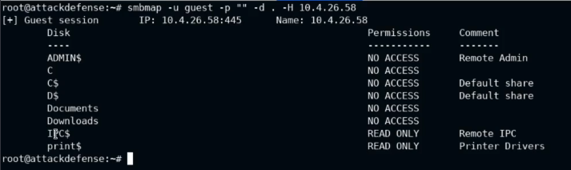
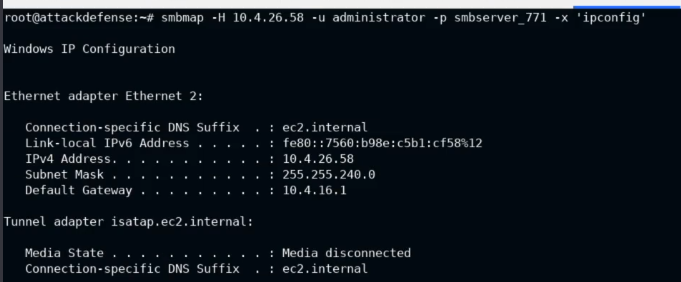
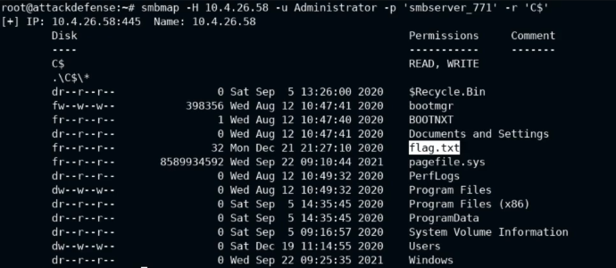
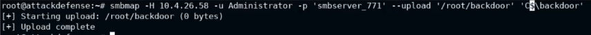
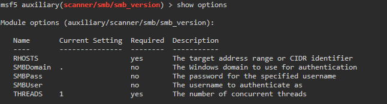
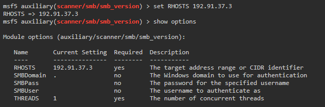
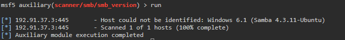
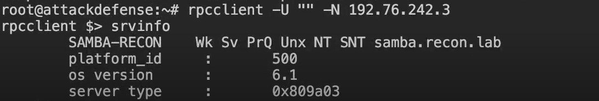
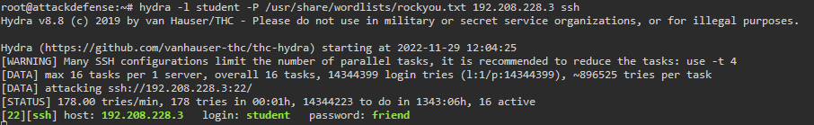

# Assessment Methodologies: Enumeration
# Indice

- [Introduccion](#introduccion)
- [Servidores y servicios](#servidores-y-servicios)
- [SMB](#smb)
  - [SMB: Windows Discover And Mount](#smb-windows-discover-and-mount)
  - [SMB: Nmap Scripts](#smb-nmap-scripts)
  - [SMB: SMBMap](#smb-smbmap)
  - [SMB: Algunas herramientas extra](#smb-algunas-herramientas-extra)
  - [SMB: Dictionary attack](#smb-dictionary-attack)
    - [Con Metasploid](#con-metasploid)
    - [Con Hydra](#con-hydra)
- [FTP (File Transfer Protocol)](#ftp-file-transfer-protocol)
  - [FTP si no tenemos usuario o password](#ftp-si-no-tenemos-usuario-o-password)
  - [FTP Anonymous Login](#ftp-anonymous-login)
- [SSH (Secure Shell)](#ssh-secure-shell)
  - [SSH: Obtener informacion del servidor](#ssh-obtener-informacion-del-servidor)
  - [SSH: Ataque de diccionario](#ssh-ataque-de-diccionario)
- [HTTP](#http)
  - [Herramientas para enumerar HTTP](#herramientas-para-enumerar-http)
  - [HTTP: Nmap Scripts](#http-nmap-scripts)
  - [HTTP: Metasploit](#http-metasploit)
  - [HTTP: APACHE](#http-apache)
- [MySQL](#mysql)
  - [Enumeracion MySQL](#enumeracion-mysql)
    - [MySQL: Metasploit modulos](#mysql-metasploit-modulos)
    - [MySQL: Nmap scripts](#mysql-nmap-scripts)
---

# Introduccion

En este temario hablaremos de servidores y servicios.

Cubriremos algunos como:
- SMB
- FTP
- SSH
- HTTP
- SQL

Objetivos del curso:
- Aprenderemos el objetivo de hacer la enumeracion de los servicios.
- Aprenderemos a identificar los servicios mas comunes y los protocolos.
- Entenderemos el proceso para enumerar protocolos y servicios desconocidos.

---
---

# Servidores y servicios

Un servidor es una maquina encargada de ofrecer uno o mas servicios.
- Servidor Mail
- AD
- ...

Puedo correr cualquier sistema operativo que se haya configurado para ofrecer un servicio.

Los servidores por su naturaleza deben de ser accesibles publicamente para poder ofrecer sus servicios.
Y estos requieren tener ciertos puertos abiertos para que se pueda acceder a lo que ofrecen.

Si lo anterior no esta configurado un atacante podría usar diversas tecnicar para acceder al servidor y tomar el control.

---

# SMB
## SMB: Windows Discover And Mount

SMB es un servicio de Windows que implementa la comparticion de archivos, un termino generico para referirse a este tipos de servicios es CIFS (Common Internet File System).

**Estos servicios suelen funcionar en el puerto 445/TCP.**

Podemos ejecutar un Nmap para descubrir estos servicios y probar de conectarnos.

Comando windows para conectar:

`net use Z: \\"IP"\"RUTA" smbserver /USER:administrator`

## SMB: Nmap Scripts

Nmap viene con muchos scripts que nos pueden ser utiles a la hora de obtener informacion, por ejemplo `script=discovery`, por lo que vamos a tratar algunos de ellos.


- **smb-protocols**: Es un script que nos ayuda a obtener informacion extra cuando estamos apuntando nuestro Nmap a un puerto con un servicio SMB.
`nmap -p445 --script smb-protocols 10.4.31.90`
---
- **smb-security-mode**: Para obtener informacion del metodo de seguridad que esta usando un servidor samba que hemos detectado en un puerto. 
---
- **smb-enum-sessions**: Para enumerar las sesiones o conexiones al servidor SMB.
`nmap -p445 --script smb-enum-sessions 10.4.31.90`

    - Con algunos Scrips podemos añadir argumentos: 

    `nmap -p445 --script smb-enum-sessions --script-args smbusername=administrator,smbpassword=smbserver_771 10.4.31.90`
---
- **smb-enum-shares**: Script util para obtener una lista de los recursos compartidos por el servidor.
    - Si le añadimos argumentos nos devolverá a que recursos tenemos acceso con la cuenta logueada: 
    
    `nmap -p445 --script smb-enum-shares --script-args smbusername=administrator,smbpassword=smbserver_771 10.4.31.90`

    - si corremos este script junto a **smb-ls** nos listara los ficheros de las rutas compartidas:
    ```nmap -p445 --script smb-enum-shares,smb-ls --script-args smbusername=administrator,smbpassword=smbserver_771 10.4.31.90```
---
- **smb-enum-users**: Nos dará una lista de los usuarios, es probable tener que poner argumentos de user para que nos devuelva toda la informacion.
---
- **smb-server-stats**: Devuelve algo de informacion del servidor.
---
- **smb-enum-domains**: Nos devuelve un poco de informacion general de los dominios del servidor.
---
- **smb-enum-groups**: Podemos ver los grupos de usuarios del dominio del servidor SMB.
---
- **smb-enum-services**: Podemos ver los servicios que estan corriendo en el servidor.
---

## SMB: SMBMap

Es un programa hecho en Python que devuelve un poco de informacion del servicion SMB.

Ejemplo de uso:

`smbmap -u "usuario" -p "password" -d . -H "IP"`

`smbmap -u guest -p "" -d . -H 10.4.26.58`



Con esta herramienta en caso de haber optenido un usuario con permisos podemos llegar a ejecutar comandos en remoto:


`smbmap -H 10.4.26.58 -u administrator -p smbserver_771 -x 'ipconfig'`

Esto nos devolvería el resultado de ejecutar un 'ipconfig' en el windows que estamos auditando:



Esta herramienta tambien nos permite ver el contenido de un recurso compartido con el atributo "-r"

`smbmap -H 10.4.26.58 -u Administrator -p 'smbserver_771' -r 'C$'`



Incluso podemos utilizar el smbmap para subir ficheros que tenemos en local al servidor de destino con el siguiente comando:

`smbmap -H 10.4.26.58 -u Administrator -p 'smbserber_771' --upload '/root/backdoor' 'C$/backdoor`



Tambien podemos descargar ficheros con los siguientes atributos:

`smbmap -H 10.4.26.58 -u Administrator -p 'smbserber_771' --download 'C$/flag.txt`

---
## SMB: Algunas herramientas extra

- Otras herramientas que podemos usar:
    - msfconsole: Metasploit framework
        - para acceder a las herramientas para obtener informacion de SMB podemos ejecutar los siguientes comandos:
            - `use auxiliary/scanner/smb/` Si damos tabular veremos las herramientas disponibles.
            - Para saber que informacion requiere usaremos el comando `show options`
            
            - para asignar uno de los valores requiridos usaremos `set`
            
            - para lanzar usaremos `run`
            

    - smbclient
        - `smbclient -L "IP" -N`
        - Tambien nos podemos conectar al servidor con el siguiente comando:
        `smbclient //IP/recurso -N`
         
    - rpcclient
        - Si tenemos acceso con una sesion null podemos obtener algo de informacion extra con `rpcclient`:
            - `rpcclient -U "" -N 192.76.242.3`
            - `srvinfo`
            
    - enum4linux
        - `enum4linux -o "ip"` --> devuelve bastante informacion util del SMB.
---
## SMB: Dictionary attack

### Con Metasploid

Hasta ahora hemos visto tecnicas que podemos usar sin autenticarnos, vamos a ver que podemos hacer en caso de necessitar loguearnos en la maquina objetivo.

Tenemos unas listas llamados WordLists que son listas de passwords que se usan comunmente o que se han filtrado en paginas web.

Estas listas las podemos usar para hacer un ataque por diccionario de fuerza bruta.

Tenemos un modulo en Metasploit para realizar esto en la ruta `auxiliary/scanner/smb/smb_login`.

Tendremos que especificarle alguna informacion:
- RHOSTS
- USERPASS_FILE --> el diccionario
- smbuser --> si queremos que ataque un usuario concreto

---

### Con Hydra

Es otra herramienta que podemos usar para realizar ataques de diccionario. Un ejemplo de sintaxis sería:

`hydra -l "user que queremos probar" -P "diccionario "IP objetivo" "protocolo que atacamos"` 

`hydra -l admin -P /usr/share/wordlists/rockyou.txt 192.125.26.3 smb`

---
---

# FTP (File Transfer Protocol)

Es un protocolo utilizado para transferencias de archivo (Como dice su nombre), suele alojarse en el puerto 21/TCP.

Para conectarnos se usa el comando `ftp "IP"`.

## FTP si no tenemos usuario o password

Si no nos deja conectarnos sin poner usuario ni contraseña podemos por ejemplo probar la fuerza bruta con `hydra`:

`hydra -L /usr/share/metasploit-framework/data/wordlists/common_users.txt -P /usr/share/metasploit-framework/data/wordlists/unix_passwords.txt "IP" ftp`

Si sabemos un usuario tambien podemos probar fuerza bruta con nmap:

`nmap "ip" --script=ftp-brute --script-args userdb="usuario o fichero con usarios" -p21`

## FTP Anonymous Login

Algunos servidores FTP tienen una vulnerabilidad que permite loguearse anonimamente.

Podemos comprobarlo con el siguiente comando **nmap**:

`nmap "IP" -p21 --script=ftp-anon`

---
---

# SSH (Secure Shell)

Es un protocolo que se usa para administracion remota y te otorga una secure shell por una conexion encriptada.

Para conectarse a una maquina con este protocolo se usa el siguiente comando: `ssh usuario@"IP"`, por ejemplo:

`ssh root@192.244.143.3`

## SSH: Obtener informacion del servidor 


- `nmap "IP" -p22 --script=ssh2-enum-algos` --> con este comando obtenemos todos los algoritmos diponibles relacionados.

- `nmap "IP" -p22 --script=ssh-hostkey --script-args ssh_hostkey=full` --> con este comando obtenemos la clave RSA del servidor ssh, nos será util mas adelante.

- `nmap "IP" -p22 --script=ssh-auth-methods --script-args="ssh.user=student"` --> obtenemos que metodos de autenticacion sporta un usuario en espedifico, si no soporta ninguno es probable que podamos conectar sin contraseña (si el usuario existe).

## SSH: Ataque de diccionario

Es muy parecido al resto de ataques de diccionario.

- Podemos usar Hydra:

    `hydra -l "login que queremos atacar" -P /usr/share/wordlists/rockyou.txt "IP" "Protocolo"` 

    - Ejemplo:

        `hydra -l student -P /usr/share/wordlists/rockyou.txt 192.141.55.3 ssh` 
        
- Tambien podemos usar NMAP como en el siguiente ejemplo:

    `nmap 192.141.55.3 -p22 --script ssh-brute --script-args userdb=/root/user`

- Tambien podemos usar nuestro amigo metasploit con el   siguiente exploit: `auxiliary/scanner/ssh/ssh_login` , tendremos que informar el diccionario y e usuario

---
---

# HTTP

Es un protocolo destinado a alojar paginas web, lo podemos encontrar tanto en inspecciones externas de una red como en internas.

Esto es una gran parte de internet.

Estas paginas pueden contener gran variedad de contenido en diferentes lenguajes, lo que abre la puerta a muchas vulnerabilidades.

## Herramientas para enumerar HTTP
- ``whatweb "IP"`` --> este comando nos puede dar algo de informacion sobre el servicio alojado.

- `http "IP"` --> tambien nos devuelve informacion.

- `dirb http://"IP"` --> enumera tambien informacion util

- `browsh --startup-url http://"IP"/ruta` para ver un sitio desde la consola. *(cntrl+w para salir)*

- `lynx "URL"` --> como browsh pero muestra la pagina un poco mas adaptada a consola quitando un poco la parte grafica.

- `curl "IP"` --> nos devuelve el codigo fuente de la pagina.

- `wget "URL"` --> nos descarga el archivo que digamos.


## HTTP: Nmap Scripts

- `nmap "IP" -p80 --script http-enum`  --> nos da informacion de directorios de la pagina web.

- `nmap "IP" -p80 --script http-headers`  --> nos da la informacion del header.

- `nmap "IP" -p80 --script http-methods`  --> para saber que metodos estan permitidos en una pagina. Podemos pasarle por argumentos un directorio especifico:
    - `nmap "IP" -p80 --script http-methods --script-args http-methods.url-path=/webdav/`

- **banner** --> nos devuelve la informacion que nos da el servidos cuando nos conectamos por primera vez.

## HTTP: Metasploit

- Herramientas para enumerar:
    - `auxiliary/scanner/http/http_version` --> dice la version.
    - `auxiliary/scanner/http/brute_dirs` --> busca los directorios a partir de una wordlist interna.
    - `auxiliary/scanner/http/robots_txt` --> muestra informacion obtenida del fichero robots.txt


## HTTP: APACHE

Todo el tema de enumeracion es muy similar a el servidor de windows, la mayor diferencia es lo que encontraremos cuando consigamos accesos a la maquina servidor.

En este caso nos encontraremos la bash de linux.

192.117.151.3
80/tcp open  http    Apache httpd 2.4.18 ((Ubuntu))
 wget http://192.117.151.3 > index | cat index

 ---
 ---

 # MySQL

 Es una de las versiones de BBDD libres de SQL mas comunes.

 Esta presente en muchas compañias y es comun que este con algunas cosas sin configurar y vulnerable. Esta suele estas en el puerto 3306/TCP.

 - algunos comandos disponibles:
    -   Para conectarnos podemos usar: `mysql -h "IP" -U "Usuario"`. En linux si no se ha configurado lo contrario por defecto el usuario de admin es **root**, por lo que podemos probar `myseql -h "IP" -U root`.

Una vez conectado al servidor podremos hacer consultar via lenguaje **SQL**.

Podemos probar comandos **SQL** como el siguiente a ver si podemos obtener datos de los ficheros del servidor: `select load_file("/etc/shadow")`

## Enumeracion MySQL
### MySQL: Metasploit modulos

- **auxiliary/scanner/mysql/mysql_writable_dirs** --> revisa los directorios disponibles en el servidor.

- **auxiliary/scanner/mysql/mysql_hashdump** --> obtenemos los hashes de usuarios.

### MySQL: Nmap scripts

Estos son algunos scripts utiles de Nmap para enumeracion de MySql:

- `mysql-empty-password` --> Te devuelve si hay algun usuario que tenga conexion sin contraseña.
- `mysql-info` --> Da informacion del servicio alojado.
- `mysql-users` --> Te devuelve una lista de los usuarios.
    - A este script hay que pasarle argumentos:
        - **mysqluser**
        - **mysqlpass**
- `mysql-databases` --> te lista las BBDD del servidor.
    - A este script hay que pasarle argumentos:
        - **mysqluser**
        - **mysqlpass**
- `mysql-variables` --> algunos datos de configuracion de la BBDD
    - A este script hay que pasarle argumentos:
        - **mysqluser**
        - **mysqlpass**
- `mysql-audit` --> hace algunas pruebas de seguridad del servidor.
    - A este script hay que pasarle argumentos:
        - **username**
        - **password**
        - **filename** --> /user/share/nmap/nselib/data/mysql-cis.audit
- `mysql-dump-hashes` --> devuelve el hash del usuario.
    - A este script hay que pasarle argumentos:
        - **username**
        - **password**
- `mysql-query` --> te permite hacer una consulta sql.
    - A este script hay que pasarle argumentos:
        - **username**
        - **password**
        - **query** --> la sentencia que queremos ejecutar.

