# Host & Network Penetration Testing: System/Host Based Attacks
# Indice

- [Introduction To System/Host Based Attacks](#introduction-to-systemhost-based-attacks)
- [Windows Vulnerabilities](#windows-vulnerabilities)
  - [Overview of Windows Vulnerabilities](#overview-of-windows-vulnerabilities)
    - [Versiones](#versiones)
    - [Tipos de Vulnerabilidades de Windows](#tipos-de-vulnerabilidades-de-windows)
  - [Frequently Exploited Windows Services](#frequently-exploited-windows-services)
- [Exploiting Windows Vulnerabilities](#exploiting-windows-vulnerabilities)
  - [Exploiting Microsoft IIS WebDAV](#exploiting-microsoft-iis-webdav)
    - [Microsoft IIS](#microsoft-iis)
    - [WebDAV](#webdav)
      - [WebDAV exploitation](#webdav-exploitation)
      - [Laboratorio WebDAV](#laboratorio-webdav)
      - [Laboratorio WebDAV con Metasploid (reverse shell)](#laboratorio-webdav-con-metasploid-reverse-shell)

---
---
# Introduction To System/Host Based Attacks

Los ataques basados en Sytem/Host son ataques que tienen como objetivo un sistema o host que esta corriendo un sistema operativo especifico, como por ejemplo Windows o Linux.

Muchas veces podremos proceder a realizar estos ataques al ganar acceso a un servicio publico de una red.

Vamos a mirar algunas de las vulnerabilidades de los SO mas conocidos y a ver como explotarlas.

# Windows Vulnerabilities
## Overview of Windows Vulnerabilities

- Windows es el sistema operativo dominante a nivel mundial, esto hace que sea el objetivo principal para ataques.

- Windows en los ultimos 15 años a tenido vulnerabilidades severas como el MS08-067(Conflicker) to MS17-010(EternalBlue).

- Debido a la popularidad de Windows estas vulnerabilidades tienen codigos de exploit publicos que hace mas facil explotarlo.

---

### Versiones

Windows tiene muchas versiones, esto crea una fragmentacion en las vulnerabilidades, esto significa que vulnerabilidades que estan en Windows 7 podrían no estar en Windows 10 por ejemplo.

Independientemente de la version de Windows hay algunas cosas de la filosofia en si del SO que comparten todas las versiones:

- La base de Windows es el lenguaje de programacion C, esto lo hace vulnerable a buffer overflows, execucion de codigo arbitraría, etc. Digamos que son vulnerabilidades del propio lenguaje de programacion.

- Por defecto Windows no esta configurado para ejecutarse de forma segura, por ello requiere que se haga activamente esta configuracion al instalar de 0 el SO. 
    - Si no se configura activamente Windows tendrá vulnerabilidades.
    - Esta falta de configuracion pasiva es debido a que Windows esta pensado para que se pueda usar en el maximo de sectores posibles (hogar, empresas, arquitectos, artistas...).

- Debido a la naturaleza fragmentada de Windows muchas vulnerabilidades tardan un tiempo en ser parcheadas, por lo que hay muchos sistemas con vulnerabilidades conocidas sin parchear.
    - Esto se refiere a que por ejemplo una empresa que usa Windows 7 puede tardar en obtener un parche de seguridad para nuevas vulnerabilidades, porque es ese momento la prioridad de Windows es su version mas reciente.

- Windows de por si es vulnerable a cross-platform vulnerabilities, por ejemplo a SQL injection.

- Windows es vulnerable a ataques fisicos (robos, USB con malware...).

---

### Tipos de Vulnerabilidades de Windows

- Information disclosure: Permite a un atacante acceder a informacion confidencial.
- Buffer Overflow: Debido a un error de programacion un atacante podría escribir informacion en un buffer y sobrescribir el local, de esta manera puede escribir en memoria del sistema.
- Remote code execution.
- Privilege escalation: Permite a un atacante elevar sus privilegios despues de una primera vulneracion de un sistema.
- DDos attacks: Permite que un atacante consumir los recursos de un sistema haciendo que no funcione con normalidad.

---

## Frequently Exploited Windows Services 

El objetivo de este curso es aprender sobre los servicios que pueden ser vulnerables y que son propios de Windows sin necesidad de instalar, y que algunos de ellos pueden estar activados por defecto.

Conocer estos servicios y sus vulnerabilidades principales es algo imprescindible para un pentester.

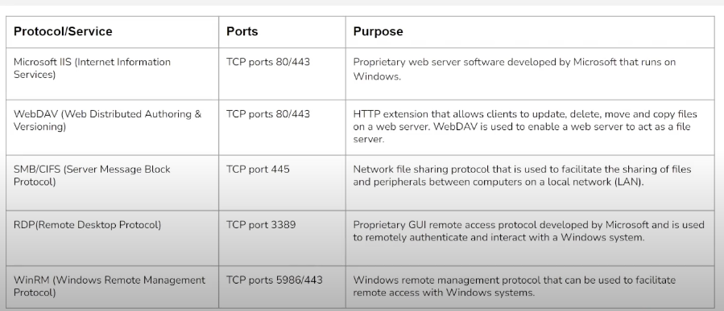

---

# Exploiting Windows Vulnerabilities
## Exploiting Microsoft IIS WebDAV 
### Microsoft IIS

Microsoft IIS es un servicio web desarrollado por Microsoft para **Windows**.

Puede alojar paginas web estaticas y dinamicas desarrolladas en **ASP.NET** y **PHP**.

Este servicio normalmente esta configurado para correr en el puerto 80 o 443 TCP.

Los archivos executables que acepta son:
- .asp
- .aspx
- .config
- .php

### WebDAV

Es un servicio web que que da una serie de extensiones **HTTP** que habilita a los usuarios para editar colaborativamente y trabajar con ficheros en servidores remotos.

Este servicio se configura encima de un servidos IIS.

El tipo de identificacion en un WebDAV es a trabes de usuario y contraseña.

#### **WebDAV exploitation**

Para vulnerar un servicio **WebDAV** podemos seguir los siguientes pasos:
1. Enumerar el Hosta para ver si tiene o no alojado un **WebDAV**, y tambien obtener informacion de la version y de si esta corriendo en un IIS o en un apache por ejemplo.
2. Una vez hemos detectado un WebDAV podemos proceder a probar con un ataque de fuerza bruta con el objetivo de conseguir unas credenciales validas.
3. Una vez que hemos conseguido autentificarnos podriamos subir alguno de los tipos de archivo que ejecuta el servidor IIS, por ejemplo un **.asp** para ejecutar codigo e incluso obtener una reverse shell.

Algunas herramientas que usaremos en este modulo son:

- davtest: Para escanear, autentificar y explotar un WebDAV server. [uso](#davtest)
- cadaver: Nos permite identificarnos en el WebDAV y realizar acciones con los ficheros (Descargar, subir, modificar...). [uso](#cadaver)

---
---

#### **Laboratorio WebDAV**

En este laboratorio ya nos dan el password y la ip del servidor, pero igualmente a mi me gusta hacer todo el proceso para practicar.

Aun así veremos que con las wordlist que tenemos no conseguiremos sacar el password, por lo que usaremos la info que nos dan para no perder tiempo con wordlist mas extensas.

Lo primero será hacer un nmap del objetivo con los scripts por defecto para que nos otorgue informacion sobre los servicios que estan corriendo y que puertos tiene abiertos.

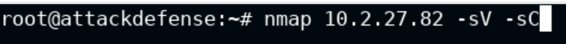
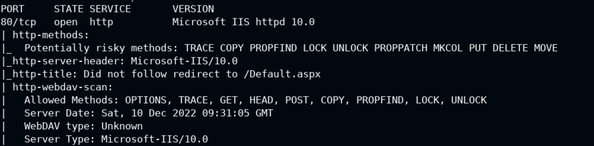

En el resultado podemos detectar que hay un servicio de Windows IIS corriendo en el puerto 80.

Si lo abrimos en el navegador podemos ver que hay alojada una pagina web:

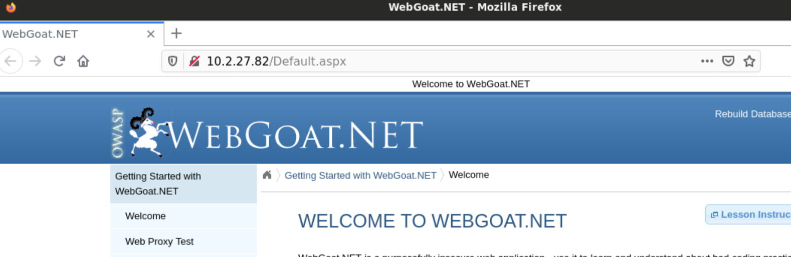

Esto es una web generica creada para practicar pentesting y se usa para ver varias vulnerabilidades, pero por el momento eso no nos interesa.

Vamos a pasar a enumerar directorios de esta web a ver si vemos algo interesante.

Para ello usaremos el script de Nmap **http-enum**

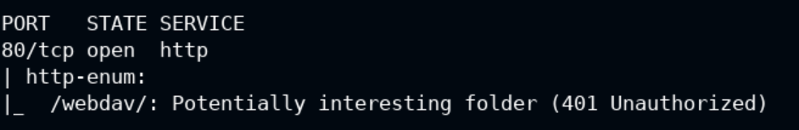

El resultado nos devuelve que hay un directorio de WebDAV y ademas el mismo script nos advierte que es una carpeta interesante.

Ademas vemos que no estamos autorizados a ver su contenido, esto es porque requiere un usuario y contraseña.

Si abrimos este directorio en el navegador verificaremos que nos pide un login:

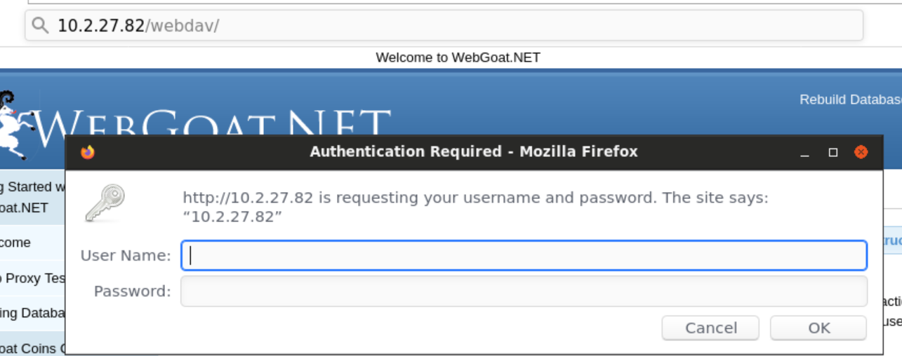

Aqui podemos aplicar fuerza bruta con Hydra usando las wordlist incluidas en Kali (En este caso no lo conseguiremos y usaremos la info de login que nos dan en laboratorio):

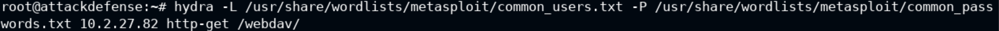

De argumentos le pasamos la lista de usuarios y una lista de passwords, ademas le decimos a que IP estamos apuntando.

Con **http-get** le decimos en que directorio apuntamos para loguearnos.

En este caso no obtenemos resultados asi que usaremos la contraseña y usuario que nos proporcionan en la info del laboratorio para no perder tiempo probando con listas mas completas que podrían llevarnos mucho rato.

Una vez loguados por la web podemos ver el contenido del WebDAV:

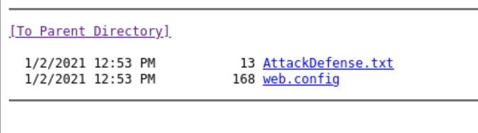

Ahora vamos a intentar explotar alguna de las vulnerabilidades de este servicio.

##### **(davtest)**

Primero vamos a obtener algo de informacion de el con la herramienta **davtest**:

Le decimos que nos enumere la URL del webdav y le proporcionamos un usuario y una contraseña:

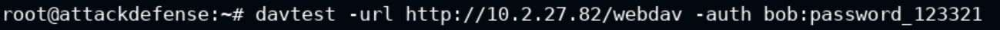
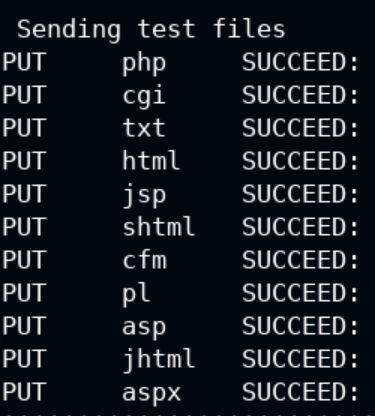
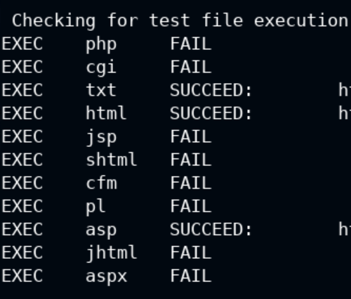

En los resultados de esta execucion podemos ver que las pruebas para subir archivos han salido todas positivas (SUCCEED) y que las pruebas de ejecucion han salido positivas **txt, html y asp**.

Con esta informacion nos podemos plantear subir una **webshell de asp** de las que vienen incluidas en Kali con el objetivo de conseguir una forma de ejecutar comandos.

##### **(cadaver)**

Para trastear con los archivos del webDAV usaremos la herramienta **cadaver**:

Esta aplicacion nos dara una consola (algo parecido a la de FTP) que nos permitirá trastear con los ficheros del WebDAV.

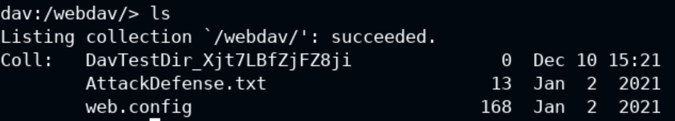

Una vez conectados vamos a proceder a subir una webshell de asp de las que tenemos en Kali:

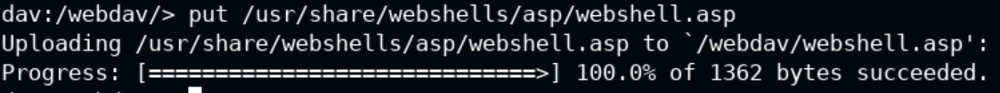

Una vez que se nos ha subido podremos verla desde la pagina web si actualizamos:

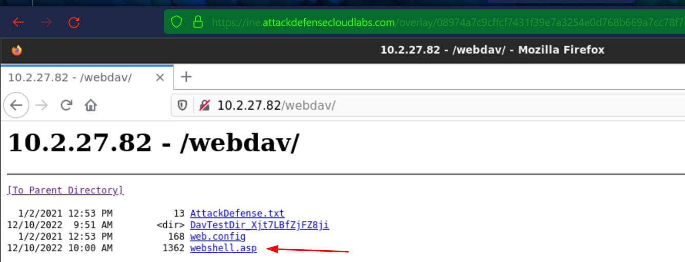

Si le clicamos y se ejecuta tendremos una webshell operativa en el servidor desde la cual podamos ejecutar comandos:

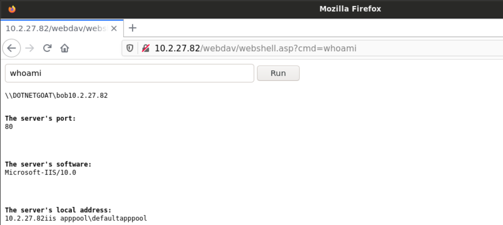

Una vez hemos obtenido esta webshell ya podemos ir en busca de la **flag** del laboratorio:

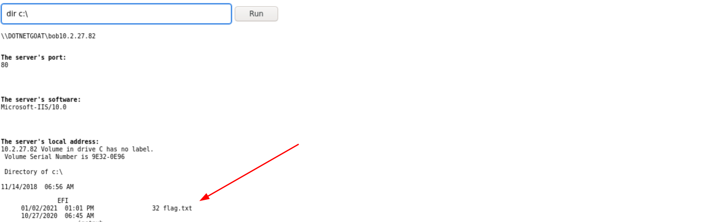
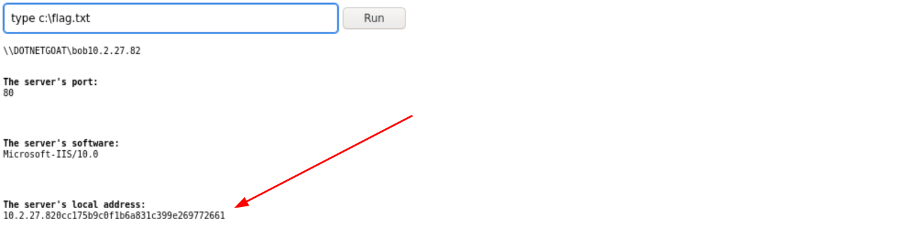

El resultado del comando se nos junta con la IP, asi que la flag empieza donde acaba la IP del servidor.

Con esto el laboratorio ya estaría resuelto.

---
---

#### **Laboratorio WebDAV con Metasploid (reverse shell)**

Este laboratorio consiste de una maquina parecida a la anterior con la diferencía de que esta bloquea alguna de las ejecuciones especificas por **.asp**, por lo que no nos permite trabajar con una webshell.

Aun asi si que permite ejecutar otros archivos **.asp**, por lo que haremos una reverse shell usando metasploit y estos archivos.

Primero de todo haremos un par de comprobaciones del objetivo para ver que tiene el servicio IIS activo en el puerto 80 y tambien para ver que existe el WebDAV enumerando los directorios:

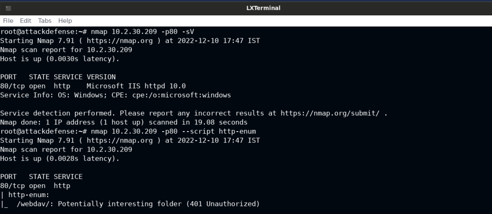

Una vez hecha esta comprobacion haremos la verificacion con **davtest** para ver si acepta subir archivos y para ver cuales se pueden ejecutar. 

Para el usuario y la contraseña nos lo chivan que es como en el laboratorio anterior:

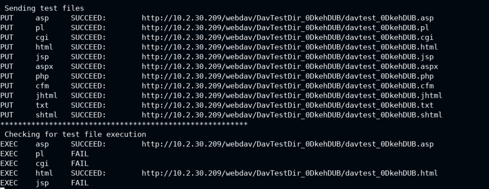

Con la ejecucion del **davtest** podemos ver los archivos que nos permite subir y ademas podemos ver que en este caso el servidor tambien permite ejecuciones de ficheros **.asp**.

Recordando que nos han chivado que en este caso el servidor bloquea ejecuciones de una webshell buscaremos otra forma, como por ejemplo probaremos a conseguir una **reverse shell** usando las funcionalidades de las herramientes de **metasploit** como **msfconsole** y **msfvenom**.

El proceso es el siguiente:

1. Con **msfvenom** generamos el **payload** en **.asp** para subirlo al servidor, este archivo sirve para ejecutarlo en el servidor y que nos envie la reverse shell. Se genera de la siguiente manera:
    1. Con el comando `msfvenom --list payloads` veremos una lista de los payloads que podemos generar. En este caso nos interesa el windows/meterpreter/reverse_tcp.
    2. Ejecutamos el siguiente comando para generar el archivo, le tendremos que informar el HOST que escucha que es la ip de NUESTRA MAQUINA y el PUERTO donde haremos la escucha desde nuestra maquina, tambien que tipo de extension de fichero queremos generar y en que fichero guardaremos el resultado:
    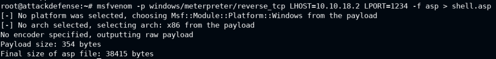
2. Una vez tengamos generado nuestro **payload** usaremos la herramienta **cadaver** para subirlo a nuestro **webdav** objetivo:
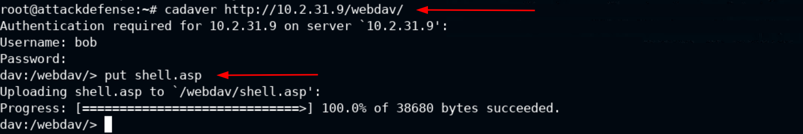
Ahora si accedemos desde el navegador veremos que nuestro **payload** ya esta en el servidor:
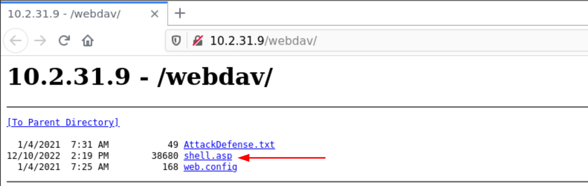
3. Nuestro siguiente objetivo será crear la conexion ejecutando nuestro fichero **.asp** pero antes de ejecutarlo debemos ponernos en escucha desde nuestra maquina, para esto usaremos un modulo de **Metasploit**:
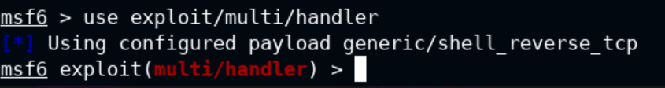
Tendremos que configurar un par de cosas para la escucha, el puerto tiene que ser el mismo que hemos puesto en nuestro **payload** y la **LHOST** la ip de la interfaz donde haremos la escucha. Tambien le tendremos que decir que tipo de payload usará:
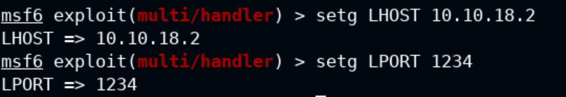
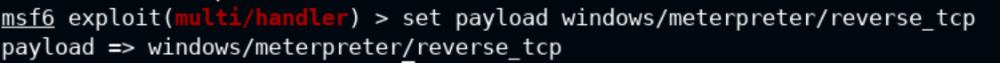
Una vez configurado ejecutamos y ya tendremos nuestra maquina en escucha esperando la conexion:
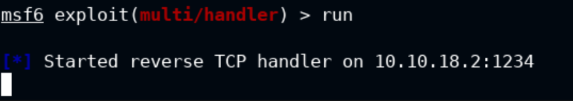
4. Una vez tengamos nuestra maquina es escucha iremos a la web del WebDAV y ejecutaremos nuestro fichero:

Acto seguido si todo ha ido bien veremos como nuestra maquina recibe la conexion y ya tendremos una consola operativa:
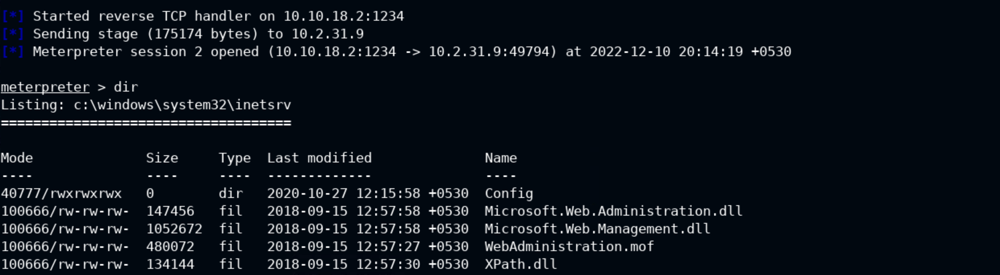

Ahora para acabar con el laboratorio solo nos queda buscar la **flag.txt** en la C: usando la consola que nos da Metasploit.

- Tambien podemos automatizar este proceso con el modulos de Metasploit `exploit/windows/iis/iis_webdav_upload_asp`, en la imagen podemos ver que informacion tenemos que rellenar y como el hace todo el proceso de subir el archivo, abrir la escucha, ejecutarlo y nos da la consola resultante (ademas limpia el archivo del servidor para no hacer ruido):
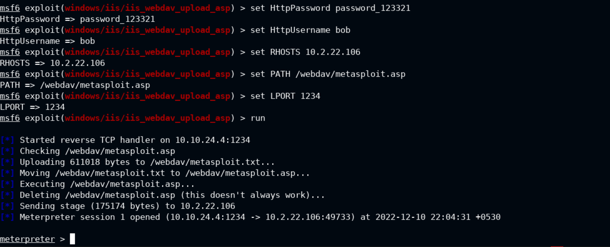

### SMB

[Para ver informacion sobre SMB podeis ir a esta parte de la teoria.](../02%20-%20Assessment%20Methodologies/02%20-%20Assesment%20Methodologies-Enumeration.md#SMB)

#### **Exploiting SMB with PsExec**

