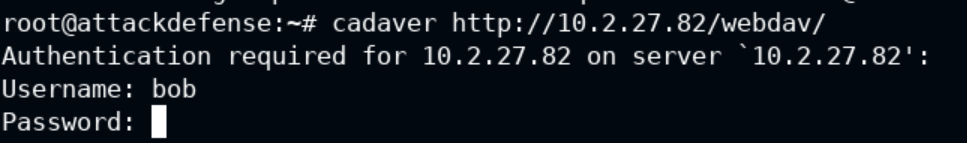
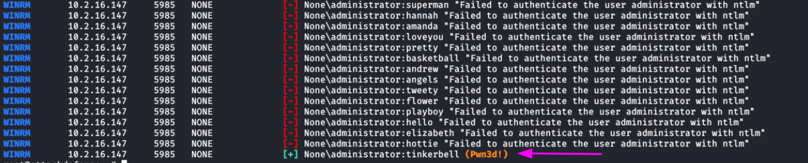

# Host & Network Penetration Testing: System/Host Based Attacks
# Indice

- [Introduction To System/Host Based Attacks](#introduction-to-systemhost-based-attacks)

## Windows

- [Windows Vulnerabilities](#windows-vulnerabilities)
  - [Overview of Windows Vulnerabilities](#overview-of-windows-vulnerabilities)
    - [Versiones](#versiones)
    - [Tipos de Vulnerabilidades de Windows](#tipos-de-vulnerabilidades-de-windows)
  - [Frequently Exploited Windows Services](#frequently-exploited-windows-services)
- [Exploiting Windows Vulnerabilities](#exploiting-windows-vulnerabilities)
  - [Exploiting Microsoft IIS WebDAV](#exploiting-microsoft-iis-webdav)
    - [Microsoft IIS](#microsoft-iis)
    - [WebDAV](#webdav)
      - [WebDAV exploitation](#webdav-exploitation)
      - [Laboratorio WebDAV](#laboratorio-webdav)
      - [Laboratorio WebDAV con Metasploid (reverse shell)](#laboratorio-webdav-con-metasploid-reverse-shell)
  - [SMB](#smb) 
    - [Exploiting SMB with PsExec](#exploiting-smb-with-psexec)
    - [Laboratorio: Exploiting SMB with PsExec](#laboratorio-exploiting-smb-with-psexec)  
    - [Exploiting Windows MS17-010 SMB Vulnerability (EternalBlue)](#exploiting-windows-ms17-010-smb-vulnerability-eternalblue)
    - [Laboratorio EternalBlue](#laboratorio-eternalblue)
    - [Laboratorio EternalBlue (metasploit)](#laboratorio-eternalblue-metasploit)
  - [RDP](#rdp)
    - [Lab: Windows: Insecure RDP Service](#lab-windows-insecure-rdp-service)
    - [Exploiting Windows CVE-2019-0708 RDP Vulnerability (BlueKeep)](#exploiting-windows-cve-2019-0708-rdp-vulnerability-bluekeep)
  - [WinRM](#winrm)
    - [Lab: WinRM](#lab-winrm)

---
---
# Introduction To System/Host Based Attacks

Los ataques basados en Sytem/Host son ataques que tienen como objetivo un sistema o host que esta corriendo un sistema operativo especifico, como por ejemplo Windows o Linux.

Muchas veces podremos proceder a realizar estos ataques al ganar acceso a un servicio publico de una red.

Vamos a mirar algunas de las vulnerabilidades de los SO mas conocidos y a ver como explotarlas.

# Windows Vulnerabilities
## Overview of Windows Vulnerabilities

- Windows es el sistema operativo dominante a nivel mundial, esto hace que sea el objetivo principal para ataques.

- Windows en los ultimos 15 años a tenido vulnerabilidades severas como el MS08-067(Conflicker) to MS17-010(EternalBlue).

- Debido a la popularidad de Windows estas vulnerabilidades tienen codigos de exploit publicos que hace mas facil explotarlo.

---

### Versiones

Windows tiene muchas versiones, esto crea una fragmentacion en las vulnerabilidades, esto significa que vulnerabilidades que estan en Windows 7 podrían no estar en Windows 10 por ejemplo.

Independientemente de la version de Windows hay algunas cosas de la filosofia en si del SO que comparten todas las versiones:

- La base de Windows es el lenguaje de programacion C, esto lo hace vulnerable a buffer overflows, execucion de codigo arbitraría, etc. Digamos que son vulnerabilidades del propio lenguaje de programacion.

- Por defecto Windows no esta configurado para ejecutarse de forma segura, por ello requiere que se haga activamente esta configuracion al instalar de 0 el SO. 
    - Si no se configura activamente Windows tendrá vulnerabilidades.
    - Esta falta de configuracion pasiva es debido a que Windows esta pensado para que se pueda usar en el maximo de sectores posibles (hogar, empresas, arquitectos, artistas...).

- Debido a la naturaleza fragmentada de Windows muchas vulnerabilidades tardan un tiempo en ser parcheadas, por lo que hay muchos sistemas con vulnerabilidades conocidas sin parchear.
    - Esto se refiere a que por ejemplo una empresa que usa Windows 7 puede tardar en obtener un parche de seguridad para nuevas vulnerabilidades, porque es ese momento la prioridad de Windows es su version mas reciente.

- Windows de por si es vulnerable a cross-platform vulnerabilities, por ejemplo a SQL injection.

- Windows es vulnerable a ataques fisicos (robos, USB con malware...).

---

### Tipos de Vulnerabilidades de Windows

- Information disclosure: Permite a un atacante acceder a informacion confidencial.
- Buffer Overflow: Debido a un error de programacion un atacante podría escribir informacion en un buffer y sobrescribir el local, de esta manera puede escribir en memoria del sistema.
- Remote code execution.
- Privilege escalation: Permite a un atacante elevar sus privilegios despues de una primera vulneracion de un sistema.
- DDos attacks: Permite que un atacante consumir los recursos de un sistema haciendo que no funcione con normalidad.

---

## Frequently Exploited Windows Services 

El objetivo de este curso es aprender sobre los servicios que pueden ser vulnerables y que son propios de Windows sin necesidad de instalar, y que algunos de ellos pueden estar activados por defecto.

Conocer estos servicios y sus vulnerabilidades principales es algo imprescindible para un pentester.

---

# Exploiting Windows Vulnerabilities
## Exploiting Microsoft IIS WebDAV 
### Microsoft IIS

Microsoft IIS es un servicio web desarrollado por Microsoft para **Windows**.

Puede alojar paginas web estaticas y dinamicas desarrolladas en **ASP.NET** y **PHP**.

Este servicio normalmente esta configurado para correr en el puerto 80 o 443 TCP.

Los archivos executables que acepta son:
- .asp
- .aspx
- .config
- .php

### WebDAV

Es un servicio web que que da una serie de extensiones **HTTP** que habilita a los usuarios para editar colaborativamente y trabajar con ficheros en servidores remotos.

Este servicio se configura encima de un servidos IIS.

El tipo de identificacion en un WebDAV es a trabes de usuario y contraseña.

#### **WebDAV exploitation**

Para vulnerar un servicio **WebDAV** podemos seguir los siguientes pasos:
1. Enumerar el Hosta para ver si tiene o no alojado un **WebDAV**, y tambien obtener informacion de la version y de si esta corriendo en un IIS o en un apache por ejemplo.
2. Una vez hemos detectado un WebDAV podemos proceder a probar con un ataque de fuerza bruta con el objetivo de conseguir unas credenciales validas.
3. Una vez que hemos conseguido autentificarnos podriamos subir alguno de los tipos de archivo que ejecuta el servidor IIS, por ejemplo un **.asp** para ejecutar codigo e incluso obtener una reverse shell.

Algunas herramientas que usaremos en este modulo son:

- davtest: Para escanear, autentificar y explotar un WebDAV server. [uso](#davtest)
- cadaver: Nos permite identificarnos en el WebDAV y realizar acciones con los ficheros (Descargar, subir, modificar...). [uso](#cadaver)

---
---

#### **Laboratorio WebDAV**

En este laboratorio ya nos dan el password y la ip del servidor, pero igualmente a mi me gusta hacer todo el proceso para practicar.

Aun así veremos que con las wordlist que tenemos no conseguiremos sacar el password, por lo que usaremos la info que nos dan para no perder tiempo con wordlist mas extensas.

Lo primero será hacer un nmap del objetivo con los scripts por defecto para que nos otorgue informacion sobre los servicios que estan corriendo y que puertos tiene abiertos.

En el resultado podemos detectar que hay un servicio de Windows IIS corriendo en el puerto 80.

Si lo abrimos en el navegador podemos ver que hay alojada una pagina web:

Esto es una web generica creada para practicar pentesting y se usa para ver varias vulnerabilidades, pero por el momento eso no nos interesa.

Vamos a pasar a enumerar directorios de esta web a ver si vemos algo interesante.

Para ello usaremos el script de Nmap **http-enum**

El resultado nos devuelve que hay un directorio de WebDAV y ademas el mismo script nos advierte que es una carpeta interesante.

Ademas vemos que no estamos autorizados a ver su contenido, esto es porque requiere un usuario y contraseña.

Si abrimos este directorio en el navegador verificaremos que nos pide un login:

Aqui podemos aplicar fuerza bruta con Hydra usando las wordlist incluidas en Kali (En este caso no lo conseguiremos y usaremos la info de login que nos dan en laboratorio):

De argumentos le pasamos la lista de usuarios y una lista de passwords, ademas le decimos a que IP estamos apuntando.

Con **http-get** le decimos en que directorio apuntamos para loguearnos.

En este caso no obtenemos resultados asi que usaremos la contraseña y usuario que nos proporcionan en la info del laboratorio para no perder tiempo probando con listas mas completas que podrían llevarnos mucho rato.

Una vez loguados por la web podemos ver el contenido del WebDAV:

Ahora vamos a intentar explotar alguna de las vulnerabilidades de este servicio.

##### **(davtest)**

Primero vamos a obtener algo de informacion de el con la herramienta **davtest**:

Le decimos que nos enumere la URL del webdav y le proporcionamos un usuario y una contraseña:

En los resultados de esta execucion podemos ver que las pruebas para subir archivos han salido todas positivas (SUCCEED) y que las pruebas de ejecucion han salido positivas **txt, html y asp**.

Con esta informacion nos podemos plantear subir una **webshell de asp** de las que vienen incluidas en Kali con el objetivo de conseguir una forma de ejecutar comandos.

##### **(cadaver)**

Para trastear con los archivos del webDAV usaremos la herramienta **cadaver**:

Esta aplicacion nos dara una consola (algo parecido a la de FTP) que nos permitirá trastear con los ficheros del WebDAV.

Una vez conectados vamos a proceder a subir una webshell de asp de las que tenemos en Kali:

Una vez que se nos ha subido podremos verla desde la pagina web si actualizamos:

Si le clicamos y se ejecuta tendremos una webshell operativa en el servidor desde la cual podamos ejecutar comandos:

Una vez hemos obtenido esta webshell ya podemos ir en busca de la **flag** del laboratorio:

El resultado del comando se nos junta con la IP, asi que la flag empieza donde acaba la IP del servidor.

Con esto el laboratorio ya estaría resuelto.

---
---

#### **Laboratorio WebDAV con Metasploid (reverse shell)**

Este laboratorio consiste de una maquina parecida a la anterior con la diferencía de que esta bloquea alguna de las ejecuciones especificas por **.asp**, por lo que no nos permite trabajar con una webshell.

Aun asi si que permite ejecutar otros archivos **.asp**, por lo que haremos una reverse shell usando metasploit y estos archivos.

Primero de todo haremos un par de comprobaciones del objetivo para ver que tiene el servicio IIS activo en el puerto 80 y tambien para ver que existe el WebDAV enumerando los directorios:

Una vez hecha esta comprobacion haremos la verificacion con **davtest** para ver si acepta subir archivos y para ver cuales se pueden ejecutar. 

Para el usuario y la contraseña nos lo chivan que es como en el laboratorio anterior:

Con la ejecucion del **davtest** podemos ver los archivos que nos permite subir y ademas podemos ver que en este caso el servidor tambien permite ejecuciones de ficheros **.asp**.

Recordando que nos han chivado que en este caso el servidor bloquea ejecuciones de una webshell buscaremos otra forma, como por ejemplo probaremos a conseguir una **reverse shell** usando las funcionalidades de las herramientes de **metasploit** como **msfconsole** y **msfvenom**.

El proceso es el siguiente:

1. Con **msfvenom** generamos el **payload** en **.asp** para subirlo al servidor, este archivo sirve para ejecutarlo en el servidor y que nos envie la reverse shell. Se genera de la siguiente manera:
    1. Con el comando `msfvenom --list payloads` veremos una lista de los payloads que podemos generar. En este caso nos interesa el windows/meterpreter/reverse_tcp.
    2. Ejecutamos el siguiente comando para generar el archivo, le tendremos que informar el HOST que escucha que es la ip de NUESTRA MAQUINA y el PUERTO donde haremos la escucha desde nuestra maquina, tambien que tipo de extension de fichero queremos generar y en que fichero guardaremos el resultado:
    
2. Una vez tengamos generado nuestro **payload** usaremos la herramienta **cadaver** para subirlo a nuestro **webdav** objetivo:

Ahora si accedemos desde el navegador veremos que nuestro **payload** ya esta en el servidor:

3. Nuestro siguiente objetivo será crear la conexion ejecutando nuestro fichero **.asp** pero antes de ejecutarlo debemos ponernos en escucha desde nuestra maquina, para esto usaremos un modulo de **Metasploit**:

Tendremos que configurar un par de cosas para la escucha, el puerto tiene que ser el mismo que hemos puesto en nuestro **payload** y la **LHOST** la ip de la interfaz donde haremos la escucha. Tambien le tendremos que decir que tipo de payload usará:

Una vez configurado ejecutamos y ya tendremos nuestra maquina en escucha esperando la conexion:

4. Una vez tengamos nuestra maquina es escucha iremos a la web del WebDAV y ejecutaremos nuestro fichero:

Acto seguido si todo ha ido bien veremos como nuestra maquina recibe la conexion y ya tendremos una consola operativa:

Ahora para acabar con el laboratorio solo nos queda buscar la **flag.txt** en la C: usando la consola que nos da Metasploit.

- Tambien podemos automatizar este proceso con el modulos de Metasploit `exploit/windows/iis/iis_webdav_upload_asp`, en la imagen podemos ver que informacion tenemos que rellenar y como el hace todo el proceso de subir el archivo, abrir la escucha, ejecutarlo y nos da la consola resultante (ademas limpia el archivo del servidor para no hacer ruido):

### SMB

[Para ver informacion sobre SMB podeis ir a esta parte de la teoria.](../02%20-%20Assessment%20Methodologies/02%20-%20Assesment%20Methodologies-Enumeration.md#SMB)
---
#### **Exploiting SMB with PsExec**

El servidor SMB tiene dos niveles de autencificacion:
- **User Authentication**: Cuando los usuarios se deben autentificar para acceder a un servidor SMB.
- **Share Authentication**: Cuando los usuarios se deben auntentificar para acceder a un cierto recurso restringido del servidor.

- **PsExec**:
    - Es un substituto ligero de telnet desarrollado por Microsoft que permite executar procesos de forma remota en sistemas Windows usando cualquier credencial de usuario.
    - La autentificacion de PsExec se hace via SMB

Para usar PsExec para ganar acceso a un objetivo Windows necessitamos identificar cuantas con sus respectivos passwords, una de las formas mas comunes para lograr esto es via brute-force.

- *Podemos hacer fuerza bruta apuntando solo a cuentas comunes que pueden existir en Windows para mejorar el rendimiento, por ejemplo al usuario Administrador*
---
#### **Laboratorio: Exploiting SMB with PsExec**

Vamos a proceder a explotar una maquina usando PsExec, primero lo haremos de una forma mas manual y luego la automatizada con metasplot. Pasos:

1. Con Nmap echamos un vistazo a los puertos de el host objetivo, haremos un ``nmap 10.2.10.170 -sV -sC ``para que nos devuelva informacion general de lo que hay en los puertos y sus versiones: 

2. Una vez que hemos detectado que hay servidores SMB en marcha en el puerto 445 nuestro objetivo es averiguar unas credenciales, para hacer esto podemos utilizar fuerza bruta.
[Aqui podemos ver algunas formas de hacerlo](../02%20-%20Assessment%20Methodologies/02%20-%20Assesment%20Methodologies-Enumeration.md#smb-dictionary-attack). Yo voy a probar de hacerlo con Metasploit utilizando las wordlist incluidas common_users.txt y unix_passwords.txt.  Como podemos ver en la imagen hemos detectado varias coincidencias, entre las cuales unas credenciales de **administrador** que son las que usaremos, ya que seguramente sean las que tienen mas privilegios.

3. Ahora para conseguir una consola con SMB usaremos **PsExec**, teniendo credenciales solo hemos de ejecutar `psexec.py Administrator@10.2.19.170 cmd.exe` informando que tipo de consola queremos conseguir, nos pedirá la contraseña y ya estaremos dentro: 

4. El paso 3 tambien lo podemos hacer desde metasploit en el modulo ``exploit/windows/smb/psexec`` y conseguiremos una consola tipo meterpreter, pero este metodo es mas invasivo y tenemos que tener mas cuidado ya que el payload lo podría detectar algun antivirus.

5. Una vez hemos logrado acceso ya solo nos queda buscar la flag para resolver el laboratorio, normalmente esta en la raiz: 
---
#### **Exploiting Windows MS17-010 SMB Vulnerability (EternalBlue)**

- [Informacion sobre EternalBlue](../02%20-%20Assessment%20Methodologies/03%20-%20Assesment%20Methodologies-Vulnerability-Assessment.md#eternalblue)

<<<<<<< Updated upstream

#### **Laboratorio EternalBlue**

1. El primer paso es enumerar para ver que encontramos (como siempre), detectamos que hay un servidor SMB corriendo en un Windows server: 

2. Para saber si es vulnerable podemos usar el siguiente script de nmap, el resultado nos confirma que el host es vulnerable:  

3. Para explotar el SMB vamos a usar un exploit llamado [AutoBlue](https://github.com/3ndG4me/AutoBlue-MS17-010), en el repositorio explica su instalacion y utilizacion.

4. Una vez que tenemos hecha la configuracion del **AutoBlue** antes de lanzarlo deberemos preparar el puerto de escucha con el comando `nc -nvlp 1234` 

5. Ahora antes de lanzarlo tendemos que otorgar permisos de ejecucion a nuestro script, lo haremos con `chmod -x eternalblue_exploit7`

6. Una vez preparados para la escucha ya podremos lanzar `python eternalblue_exploit7 10.10.10.12 shellcode/sc_x64.bin`

7. Si esperamos en la ventana donde estabamos en escucha y todo ha ido bien ya tendremos la consola operativa: 

#### **Laboratorio EternalBlue (metasploit)**

Para automatizar esto con metasploit solo tenemos que buscar el modulo de exploit `exploit/windows/smb/ms17_010_etermalblue` y es practicamente automatico.

---

## RDP 
**Remote Desktop Protocol**
- Es un protocolo de escritorio remoto desarrollado por microsoft con iinterfaz grafica.

- Este protocolo utiliza por defecto el puerto 3389 TCP.

- Requiere de unas credenciales para loguearse, podemos hacer brute-force para conseguirlas y ganas acceso.

---

### **Lab: Windows: Insecure RDP Service**

Vamos a probar de ganar acceso a un servidor que esta corriendo este servicio via fuerza-bruta:

1. Vamos a realizar un nmap de nuestro objetivo para listar los servicios que esta corriendo:  Podemos ver que hay un certificado SSL en el puerto 3333, aunque no sea el puerto por defecto del RDP podría estar corriendo aqui. 

2. Para comprobar si hay o no un servicio RDP corriendo en el puerto 3333 usaremos el modulo de metasploit `scanner/rdp/rdp_scanner`  En el resultado podemos ver que nos devuelve positivo

3. Una vez hemos verificado que hay un servicio RDP corriendo en el puerto 3333 podemos proceder a realizar un ejercicio de fuerza bruta, en este caso voy a utilizar la herramienta **Hydra**: `hydra -L /usr/share/metasploit-framework/data/wordlists/common_users.txt -P /usr/share/metasploit-framework/data/wordlists/unix_passwords.txt rdp://10.2.21.142 -s 3333`  Hemos tenido varias coincidencias de usuario-password, pero la que mas nos interesa es la de **Administrator**.

4. Ahora que hemos obtenido unas credenciales que parecen ser de **administrator** nos vamos a loguear con ellas en el servicio untilizando `xfreerdp /u:administator /p:qwertyuiop /v:10.2.21.142:3333 `, nos saldrá un mensaje de que si confiamos en el certificado, le decimos que si y si todo esta bien obtendremos acceso: 

5. Ahora solo nos queda buscar la flag en el sistema de archivos:  

---

### **Exploiting Windows CVE-2019-0708 RDP Vulnerability (BlueKeep)**

Antes de empezar con el laboratorio es necessario leer algo de información sobre [BlueKeep CVE-2019-0708](https://cve.mitre.org/cgi-bin/cvename.cgi?name=CVE-2019-0708).

Es una vulnerabilidad que afecta a ciertas versiones de RDP y que permite acceder a partes de la memoria del kernel para ejecutar codigo de forma remota.

Microsoft hizo un parche para arrehlar esta vulnerabilidad el 14 de Mayo de 2019.

Por internet se encuentran muchos exploits para esta vulnerabilidad, pero hay que ir con cuidado porque hay algunas que no funcionan como querriamos.

Tambien se puede explotar via modulos de **Metasploit**, que es la que vamos a hacer ahora.

Proceso para explotar la vulnerabilidad con **Metasploit**:

1. Primero de todo hacemos un LDAP para ver que servicios esta corriendo: 

2. Despues verificaremos si el servicio es vulnerable con el modulo de **Metasploit** `auxiliary/scanner/rdp/cve_2019_0708_bluekeep`: 

3. Una vez que sepamos que es vulnerable usaremos el modulo `exploit/windows/rdp/cve_2019_0708_bluekeep_rce` para conseguir una consola tipo **meterpreter**, una particularidad de este modulo es que le tendremos que decir de que tipo es nuestro objetivo de la siguiente forma:  Una vez configurado esto ya podremos ejecutar el exploit:  

**Con este tipo de exploits que atacan al kernel tenemos que tener mucho cuidado cuando hagamos auditorias, porque pueden llegar a romper la maquina objetivo.**

---

## WinRM

- Es un servicio de Windows que no viene activado por defecto, es un protocolo para administrar remotamente que trabaja sobre HTTP(S).

- Por defecto funciona en los puertos 5985 y 5986.

Para autentificarse en WinRM puede ser via usuario+password o usuario+hash.

Se puede usar una utilidad llamada `crackmapexec` para realizar una hacer fuerza bruta en WinRM para conseguir usuarios y contraseñas para ejecutar algunos comandos.

Tambien podriamos utilizar `evil-winrm`, que es un script de ruby que nos otorga directamente una command shell.

### Lab: WinRM

1. Primero de todo vamos a hacer un nmap para localizar servicios alojado en los puertos del objetivo:  

2. Hemos detectado que en el puerto **5985** hay alojado un servicio, este es uno de los puertos por defecto de **WinRM**, asi que voy a lanzar algun script de nmap contra este puerto para sacar algo mas de informacion:  Podemos ver que el servicio esta corriendo sobre un http. Aun asi quiero hacer unas comprobaciones mas para ver si es un WinRM, ejecuto una prueba rapida con metasploit para ver si acepta logins de WinRM: 

3. Ahora que ya sabemos que existe un servicion de WinRM en el objetivo vamos a usar `crackmapexec` para realizar un ejercicio de fuerza bruta 
- `crackmapexec winrm  10.2.16.147 -u administrator -p /usr/share/metasploit-framework/data/wordlists/unix_passwords.txt`, en la informacion del lab nos dicen de usar un fichero para usuarios, pero sabiendo que es Windows he decidido buscar directamente **administrator** ya que es un usuario que viene por defecto en estos sistemas y suele tener permisos, y ademas ahorramos mucho tiempo con la fuerza bruta, resultado: 

4. Una vez tenemos un usuario y una contraseña otra cosa que nos permite la aplicacion `crackmapexec` es ejecutar comandos con el atributo **-x**: 

5. Es una forma un poco tediosa si tubieramos que realizar alguna cosa mas compleja en el objetivo, asi que podemos usar el Script de ruby `evil-winrm`, que nos dara una shell directamente:  

6. Como opcion adicional podemos conseguir una consola Meterpreter via `metasploit`:    

---
---

# Windows Privilege Escalation
- Entendemos escalada de privilegios la accion de aprovechar vulnerabilidades o configuraciones erroneas en los sistemas para escalar nuestros permisos de un usuario a otro, normalmente para conseguir permisos de administrador.
- Esto es muy util porque un alto porcentaje de las veces conseguiremos acceder a sistemas con usuarios que no tienen permisos para segun que cosas, por lo que hacer esta escalada será algo indispensable en cualquier test de penetracion.
- Tener un buen conocimiento de como hacer estos procesos de **Privilege Escalation** nos marcara como un buen profesional dentro del pentesting.
## Windows Kernel Exploits
### ¿Que es el Kernel?
Antes de empezar a hablar de exploits que atacan el **Kernel** debemos entender que es el **Kernel**_
- El Kernel es un programa informatico que esta en el core de un sistema operativo, este tiene control total de cada recurso y del hardware del sistema. Actua como una capa de traduccion entre el hardware y el sofware facilitando la comunicacion entre ellos.
- **Windows NT** es el Kernel que viene empaquetado con todas las versiones de **Microsoft Windows**, este actua como un Kernel tradicional exceptuando alguna excepcion. Este consiste de dos modos de opearacion que determinan el acceso al los recursos y el hardaware:
  1. User Mode: Los programos ejecutados en este modo tienen acceso limitado a los recursos del sistema y a sus funcionalidades
  2. Kernel Mode: Todo lo que se ejecute en este modo tiene acceso total a los recursos del sistema y a las funcionalidades, y se añade la funcionalidad de maejar el hardware y la memoria del sistema.
### Windows Kernel Exploitation
- El **Kernel** de windows tiene vulnerabilidades, estas se pueden aprovechar para ejecutar codigo en busqueda de realizar comandos con provilegios de administrador o de conseguir una **system shell**.
- Estos procesos variarán dependiendo de la version de Windows.
- La escala de privilegios de **Windows** es usual que siga dos pasos:
  1. Identificar las vulnerabilidades del Kernel.
  2. Descargar, compilar y transferir un exploit del Kernel al sistema objetivo.

Para realizar unas pruebas sobre esto usaremos un par de herramientas:
  - Windows-Exploit-Suggester: Es un script de Python que compara la base de datos de vulnerabilidades de Microsoft con el parche actual del objetivo para poder detectar posibles parches que falten para arreglar vulnerabilidades. 
    - Tambien te notifica si hay exploits publicos o modulos de Metasploit para estas vulnerabilidades.
    - [GitHub](https://github.com/AonCyberLabs/Windows-Exploit-Suggester)
  - Windows-Kernel-Exploits: Es una coleccion de exploits para el Kernel de Windoes ordenados por CVE:
    - [GitHub](https://github.com/SecWiki/windows-kernel-exploits)

---

#### Proceso: Windows Kernel Exploitation

En la demostracion partimos de un objetivo en el que hemos logrado acceso con un usuario que tiene pocos privilegios: 

1. Vamos a usar primero de todo un modulo de **Metasploit** que enumera las vulnerabilidades conocidas de un OS, el modulo es `post/multi/recon/local_exploit_suggester`, la unica opcion que tenemos que configurar es la de `session`, metasploit te permite tener diferentes sesiones activas de diferentes modulos, previamente de usar este modulo tenemos que tener una sesion activa con un `meterpreter` del host objetivo. Para crear una sesion de meterpreter ejecutamos `background` desde el, asi pasara a un segundo plano y ya podemos ir al modulo para enumerar:   En las capturas vemos como nos devuelve una serie de vulnerabilidades y tambien algunos modulos con los que las podemos explotar.

2. Usaremos uno de los modulos que nos ha devuelto al consulta anterior, concretamente esta vez usaremos el `exploit/windows/ms16_014_wmi_recv_notif`, el uso es muy sencillo, solo deberemos informar en que sesion de **meterpreter** queremos lanzar el exploit y a que puerto queremos que nos devuelva una reverse shell, una vez lanzado esperamos y si todo va bien nos devolverá un **meterpreter** con privilegios de administrador: 

Como podemos comprobar **metasploit** automatiza todo este proceso haciendolo bastante sencillo, vamos a probar de hacerlo de una forma un poco mas manual:

1. Primero de todo, si miramos la info del [Github de Windows-Exploit-Suggester](https://github.com/AonCyberLabs/Windows-Exploit-Suggester) veremos que necesitamos la informacion que devuelve el sysinfo para ejecutarlo, para conseguirla conseguiremos una shell con meterpreter y ejecutaremos el comando:  El resultado del comando lo guardaremos en un txt en nuestro host.

2. Despues nos vamos al directorio donde nos hayamos descargado el repositorio para poder ejecutar el script de python. Ejecutaremos varios comandos:
    1. `./windows-exploit-suggester.py --update` --> esto nos va a generar un fichero **.xls** con una base de datos de vulnerabilidades que usaremos en el siguiente comando.

    2. `./windows-exploit-suggester.py --database 2021-12-26-mssb.xls --systeminfo win7.txt` --> con la base de datos que hemos generado y el txt que hemos copiado previamente.
Esto nos devolverá una lista de vulnerabilidades de nuestro Windows.  

3. Si buscamos en el repositorio de [SecWiki](https://github.com/SecWiki/windows-kernel-exploits) la vulnerabilidad **MS16-135** (Que segun el retorno del comando anterior es un exploit que sirve para privilege escalation) encontraremos un .exe, este es el que descargaremos para usar:  

4. Ahora usaremos meterpreter para subir el .exe descargado:  

5. Una vez subido conseguiremos una shell con meterpreter para ejecutarlo:  

6. Lo ejecutamos tal y como se muestra a continuacion y ya tendremos nuestra linea de comandos con privilegios de administrador:   

---

## UAC (User Account Control)

- Es una caracteristica de seguridad de windows introducida en Windows Vista que se usa para prevenir que se hagan cambios no autorizados.

Para explotar esta vulnerabilidad tenemos varias opciones:
- Metasploit: Existe un modulo para Metasploit para comprobar si una maquina es vulnerable y para conseguir una terminal `meterpreter`
- [AutoBlue-MS17-010](https://github.com/3ndG4me/AutoBlue-MS17-010): Es un exploit para hacer el proceso mas manual. (Este es el que usaremos en el proximo laboratorio)

- Hace que cada cambio al sistema operativo requiera autorizacion, por lo que si el usuario que ejecuta estos cambios tiene permisos de administrador le saldrá un PopUp para que confirme la accion:  

- Si el usuario que va a realizar la accion que requiere de permisos no es del grupo de administradores el PopUp será un login para poner un usuario con permisos.

- Como atacantes tendremos que hacer un ByPass de este sistema para poder ejecutar programas maliciosos con privilegios de administrador sin tener que pasar por el PopUp de consentimiento, ya que este le sale a todos los usuarios del grupo de administradores (exceptuando al usuario Administrator), y no lo podremos haceptar desde los comandos.

### Bypassing UAC With UACMe

- Para poder hacer un bypass necessitaremos primero de todo una cuenta de usuario que forme parte del grupo de administradores.
- Hay varias maneras de hacer este ByPass dependerá de la version de Windows que este corriendo.

La herramienta que usaremos será [UACme (GitHub)](https://github.com/hfiref0x/UACME):
- Es una herramienta open source para escalada de privilegios que se puede usar para hacer el ByPass
- El GitHUb contiene muy buena documentacion de una lista de metodos para hacer este procesos.
- Permite executar Payloads con privilegios para abusar de la herramienta de Windows AutoElevate Tool.
- El GitHub contiene Exploits.

#### **Lab: Bypassing UAC With UACMe**

1. Primero de todo vamos a enumerar que servicios estan corriendo en nuestra maquina:  Detectamos algunos servicios que podrían ser vulnerables:
    1. Puerto 80 vemos que hay un http activo
    2. Puerto 445, podría ser un SMB
    3. Puerto 5985, podría estar corriendo un WebDAV vulnerable

2. Voy a mirar primero a ver que encontramos en el servidor http accediendo a la IP por FireFox:  Encontramos en gestor de ficheros **HttpFileServer 2.3** desarrolado por Rejetto. 
    - He mirado en la base de datos de [exploit-db](https://www.exploit-db.com/) y encuentro que este servicio tiene una vulnerabilidad que permite executar comandos con un modulo de metasploit (se tensa): 

3. Vamos a acceder a nuestra consola de Metasploit a buscar el modulo para el exploit de **Rejetto**:  Informando solamente la IP victima ya nos devuelve un meterpreter.

4. Nos movemos a una shell para obtener algo de informacion: 
    - Vemos que hay dos usuarios admin y Administrator

    

    - Nosotros somos admin, tiene pinta de que somos del grupo de administradores, aun asi al no ser administrator no podriamos ejecutar nada ya que la UAC nos estaría bloqueando. Antes de seguir confirmo que seamos del frupo de administradores:

    

5. Ahora que ya sabemos que somos del grupo de administradores podemos probar de hacer un ByPass de la UAC con el objetivo de ejecutar una reverse shell como administrador y escalar privilegios.
    
6. Primero de todo me voy a abrir otra consola para generar un payload que enviaremos a la maquina victima (es el que ejecutaremos mas tarde con el ByPass):  Generamos un Payload de extension tipo **.exe**

7. Ahora tenemos que informarnos de que modulo de UACMe nos puede servir para ejecutar nuestro payload saltandonos la UAC, para ello vamos al repositorio [UACme (GitHub)](https://github.com/hfiref0x/UACME). Si vamos a la seccion **Usage** veremos una lista de claves, una que sabemos que funciona para este caso es la 23, esta la usaremos como argumento cuando lo vayamos a ejecutar.
    - Normalmente UACMe tiene que ser compilado, pero para ahorrarnos ese proceso el mismo laboratorio nos lo ha dejado compilado en el escritorio de nuestro host 

8. Ahora con todo lo que tenemos lo que nos interesa hacer es subir nuestro payload y el executable de UACMe "Akagi64.exe" a nuestro objetivo, usaremos la meterpreter que tenemos abierta para subirlos a la carpeta C:\Temp (si no existe la generamos): 

9. Ahora lo que haremos es ejecutar el UACMe que hemos subido para que nos ejecute nuestro payload saltandose la UAC, pero para esto antes tenemos que ponernos en escucha en otra consola: 

10. Ahora nos abriremos la shell para ejecutar los archivos que hemos subido:  Y si todo va bien obtendremos una consola en la terminal que estubieramos escuchando: 

11. Ahora seguiremos estando conectados como admin, pero con una diferencia, que esta consola se esta ejecutando con derechos de administrador, por lo que si desde meterpreter ejecutamos ´ps´ podremos migrar a alguno de los servicios listados para obtener el usuario que lo esta ejecutando:  Vamos a migrar al lsass.exe que tiene **PID** 688, una vez migrado podemos ver como ya hemos conectado como **Administrador y maximos privilegios**:

    

12. Ahora ya podemos adquirir la flag que nos piden, que en esta caso es el hash del admin. Usamos el comando `hashdump`: 

---

## Acces Token Impersonation

- Los *Windows Acces Token* son un elemento core del proceso de autentificacion en Windows y los crea y maneja el servicio local Authority Subsystem Service (LSASS).

- Es algo parecido a una cookie de una web, es un token que te permite mantener unos permisos sin tener que estarte autentificando cada vez que accedemos a un recurso.

- Estos token son generados en el proceso **winlogon.exe** cada vez que un usuario se loguea e incluyen la identidad y los privilegios de este usuario. Una vez generados se añaden al processo **userinit.exe**, despues de esto todos los procesos que se inicien por el usuario obtienen una copia de este token y corren bajo sus privilegios.

- Estos tokens se organizan en categorias basadas en el nivel de seguridad que se le asignan, habitualmente son asignados a una de estas des categorias:
    1. **Impersonate-level**: Se generan en procesos no interactivos de windows, generalmente en servicios de sistema especificos o en domain logons.
    2. **Delegate-level**: Se generan despues de un login interactivo, como puede ser un login de Windows o una conexion via RCP.

- Los **impersonate-level** tokens se pueden usar como impersonate en en sistema local donde se generan pero no se pueden usar en sistemas externos.
- Los **Delegate-level** tokens son el mayor agujero en este aspecto porque se pueden usar como si fueran **Impersonate-level** tokens en cualquier sistema, interno o externo.

- El proceso para escalar privilegios via estos tokens dependerá de los privilegios que tenga asignado en usuario con el que hemos accedido.

- Los permisos que necessitamos para hacer un **Acces Token Impersonation** attack con exito son los siguientes:
    1. SeAssignPrimaryToken: Permite al usuario generar impersonate tokens.
    2. SeCreateToken: Permite al usuario el crear un token arbitrario con privilegios de administracion.
    3. SeImpersonatePrivilege: Permite al usuario crear un proceso bajo el contexto de seguridad de otro usuario, normalmente con privilegios de administrador.

### Incognito (Meterpreter)

Incognito es un modulo de meterpreter (originalmente era una aplicacion independiente), que permite Impersonate user tokens despues de una explotacion exitosa.

- Podemos usar este modulo para ver una lista de los posibles tokens que podemos impersonar.

### Lab:Acces Token Impersonation

En este Laboratorio aprenderemos a escalar privilegios con los tokens que tenemos disponibles, en el futuro aprenderemos exploits para obtener mas tokens pero de momento no.

1. Primero de todo y como en los demas laboratorios empezamos enumerando los servicios de los puertos de objetivo:   Esto ya lo conocemos del laboratorio anterior, es un gestor de archivos desarollado por Rejjeto y que ademas tiene una vulnerabilidad explotable con un modulo incluido en Metasploid.

2. Conseguimos una consola Meterpreter con el modulo correspondiente de Metasploit:  
3. Vamos a comprobar que privilegios tenemos con nuestro usuario actual (NT AUTHORITY\LOCAL SERVICE):  Vemos que es un usuario sin privilegios, aunque si que tenemos activado el permiso **SeImpersontePrivilege**, que esto nos permite crear procesos bajo los permisos de otro usuario.
4. Vamos a usar lo descubierto en el punto 3 para con la aplicacion **Incognito**, impersonar otro usuario.
    1. Primero de todo cargamos el modulo **incognito** en nuestro meterpreter:  
    2. Ahora podremos usar una funcion para listar los tokens disponibles `list_tokens`:  Parece que uno de los tokens que tenemos disponibles es el de **ATTACKDEFENSE\Administrator**
    3. Vamos ahora a impersonar el usuario Administrator con el comando `impersonate_token "ATTACKDEFENSE\Administrator"`:  
    4. Una vez ejecutado el comando anterior podemos validar que ya estamos como Administrator, aun asi no nos deja ver nuestros privilegios, esto puede ser porque colgamos de un proceso de x32 bits, asi que es recomendable migrar a explorer si tenemos permisos. Una vez migrado ya podremos ver que hemos escalado privilegios: 
    5. Tambien podemos comprabar que desde este usuario podemos ver mas tokens que antes: 
    6. Teniendo el usuario Administrador ya podemos abrirnos una shell e ir a buscar la flag, que en este caso nos dicen que esta en su escritorio: 

